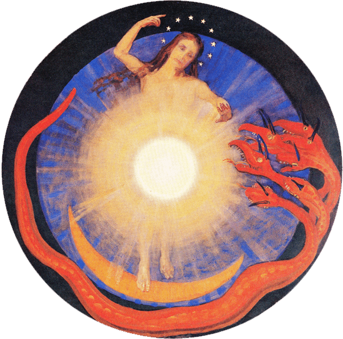

The Evening of Light muses are four para-corporeal women who run their own playlists and mixes on the website. Each has her own favourite genres, and while their tastes sometimes overlap, you'll find that you can generally associate a muse with a mood. Perhaps you'll gravitate to one or more of them, and if so, you'll know who to follow in particular.

Use the menu at the top to select reviews, playlists, and shows by each of the muses, or check out the occasionally updated Spotify playlists below to get a rough impression.

* * *

**Ἀρέθουσα** \[ΡΕΘΙ\]

**isolation, introspection, relaxation** — ambient, folk, drone, acoustic, vocal, field recordings, early music, spiritual

https://open.spotify.com/user/qwallath/playlist/3Cn3VvAOVyeZRn3dmdaerv?si=wZz\_afATQm26QEIc4G32Kg

* * *

**Μηλινόη** \[ΜΕΛΙ\]

**despair, dementia, dissent** — black metal, death metal, funeral, dungeon, dark ambient, sadgaze, harsh electronics, intense (neo-)classical

https://open.spotify.com/user/qwallath/playlist/3WBeDB6OskmzDLGUQJFGjx?si=7XQmP5dkSz6\_XzpCha4KJg

* * *

**Hadewych** \[Hedda\]

**enthusiasm & stubbornness** — rock, heavy metal, punk, hardcore, pop, tunes, hip-hop, r&b, vaporwave

https://open.spotify.com/user/qwallath/playlist/432k0kT2nO5AVDQwCZoIoj?si=p-cxgFqsTIGjsBRegn9Dbw

* * *

**Genevieve** a.k.a. **voidassembly\_progenitrix\_v∞** \[v∞\]

**structure, texture, movement** — electronics, synth, post-rock, jazz, beats, house, avantgarde, musique concrète

https://open.spotify.com/user/qwallath/playlist/31WEkYl21WDQiRcXoOXZdl?si=3q28WfXTS5-Jv0v0sKTraw
