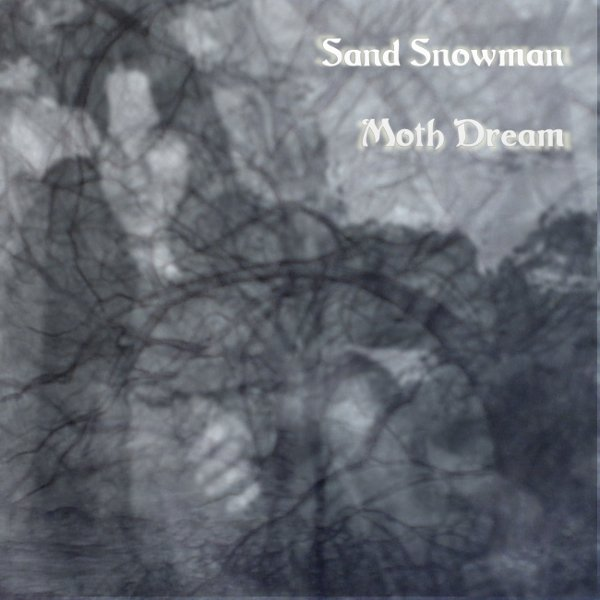

artist: **Sand Snowman** release: _Moth Dream_ format: MP3 year of release: 2006 label: Woven Wheat Whispers duration: 45:23

detailed info: [discogs.com](http://www.discogs.com/Sand-Snowman-Moth-Dream/release/1618789)

**Sand Snowman** is a one person project from London, whose initiator is credited as "The Snow Snowman" in the booklet. On _Moth Dream_, Snowman displays a quite original mix of acoustic and electric guitar playing, various other instruments, and a lot of effects and manipulation.

All of this is combined in a quite psychedelic and relaxed approach to music. On many of the instrumental tracks we encounter a soothing mix of melodies and effects, which both produce the dreamy and shadowy feeling that is also called forth by the album cover and the titles. On "Moth, Dream, Smokescreen", "The Serpentine Suite" and "Federlin", Snowman shows some excellent guitar playing, somewhere between classical guitar and modern interpretations, all slightly reminiscent of **James Blackshaw**'s work. Paired with the great ambient and freaky atmospheres in some parts, this would make for quite an excellent album. Sadly enough, there is a downside, and that is the part where the bass and percussion kick in prominently, especially on "Ghosts of Dust" and the second part of "Light, Space, Shadow". Somehow these parts are too 'funky' and psychedelic rock for my tastes. Not only because of the way they remind me of 70's TV show theme songs (in a bad way), but most of all because they combine horribly with the calmer parts of the album, greatly diminishing the atmospheric potential that these songs definitely have.

This important lesser point really bugs me, and prevents this album from being convincing. If you enjoy a bit of slightly cheesy rock in between, and you're in a light mood, perhaps this won't bother you as much. But, whichever way you turn it, this album is not suitable as a 45-minute dream trip, which it easily could have been. A missed chance.

Reviewed by **O.S.**

Tracklist:

1\. Ghosts of Dust (6:45) 2. Moth, Dream, Smokescreen (5:08) 3. Light, Space, Shadow (8:57) 4. The Serpentine Suite (15:03) 5. Federlin (6:28) 6. A Brief History of Humiliations (3:02)
