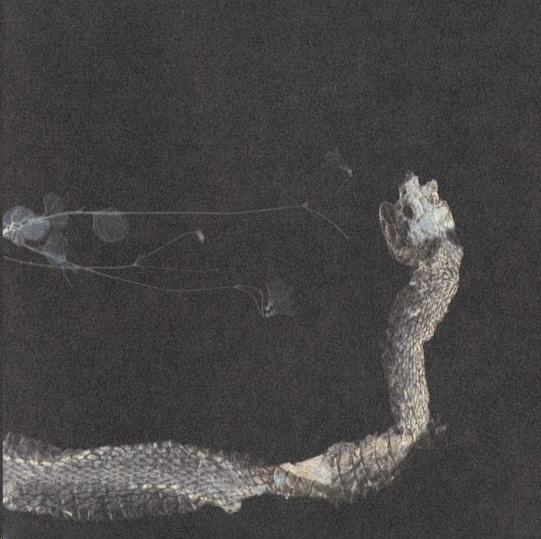

artist: **Tenhi** release: _Maaäet_ format: CD year of release: 2006 label: [Prophecy](http://www.prophecy.cd/) duration: 60:18

detailed info: [discogs.com](http://www.discogs.com/Tenhi-Maa%C3%A4et/master/148027)

_Maaäet_ is **Tenhi**'s third full length album, and I think it is safe to say that this is their best yet. This wonderfully innovative band just keeps improving a step at a time, developing their unique blend of modern folk.

As on their earlier works, **Tenhi** uses drums, guitar, bass, piano, violin, flute, and vocals as the base of their songs. Some instruments feature more prominently on one song, and some on the other, but on the whole, this album is slightly more piano-driven than the previous releases.

I am tempted to try and list all of the highlights on this album, but I fear that without some restraint, I'd write a little review about each of these twelve tracks, as there isn't one weak song on this great album. So _with_ restraint, here is an impression of some moments that touched me in particular. The album starts off with the serene "Varpuspäivä", a wonderful song in the vein of "Kielo" from the _airut:ciwi_ EP. The guitar melody on "Kuulut Kesiin" is also very appealing, and something that sounds different from what we've heard before from the band. Further on there's the melancholic "Viimeiseen", and the great piano solo work on "Vähäinen Violetissa". "Maa Syttyy" is dark, ambient-like piano track with an impressive wall of reverbed vocals. "Aatos" is a fragile little piece of acoustic guitar and vocals, which die hard fans of the band may have picked up from the website in an early demo version. I'll quit with the last track of the album, the uplifting "Rannalta Haettu", in which the lead melody and rhythm section impresses me the most.

I think it's become clear by now that I am very enthusiastic about this album. Tenhi always manage to touch me with their wide array of feelings and atmospheres, compressed in a very tight and superbly executed musical whole. And to think I almost forgot to say something about the superb artwork and especially the beautiful booklet, which contains all the lyrics and their translations, and many illustrations by the band itself. I am looking forward to the re-release of the _Airut:aamujen_ album, originally released under the name **Harmaa**. I'm also cautiously hoping for a European tour. Until then, get this album, you won't regret it.

Reviewed by **O.S.**

Tracklist:

1\. Varpuspäivä (6:31) 2. Kuoppa (4:32) 3. Kuulut Kesiin (3:34) 4. Salain (4:40) 5. Viimeiseen (7:00) 6. Vähäinen Violetissa (6:16) 7. Sarastuskävijä (5:59) 8. Maa Syttyy (2:15) 9. Tuulenkaato (5:00) 10. Aatos (2:14) 11. Uuva Oravan Luu (4:59) 12. Rannalta Haettu (7:18)
