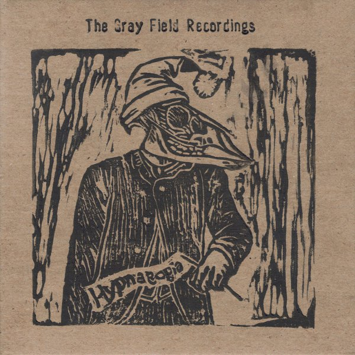

artist: The Gray Field Recordings release: Hypnagogia format: CD-R, MP3 year of release: 2005 (CD-R), 2006 (MP3) label: [AntiClock](http://www.anticlock.net/) (CD-R), [Woven Wheat Whispers](http://www.wovenwheatwhispers.co.uk/) (MP3) duration: 42:58

detailed info: [discogs.com](http://www.discogs.com/Gray-Field-Recordings-Hypnagogia/master/270151)

_Hypnagogia_ is the latest album by **The Gray Field Recordings**, a solo project by American lady R. The album was originally released in an edition of 123 handmade CD-Rs by **AntiClock** records, which of course quickly sold out. It was re-released on MP3 this year by **Woven Wheat Whispers**.

What we get on this album is a load of obscure music, with a definite dark ambient atmosphere, but quite original. The music is a mixture of melodies on folk instruments, excellent spoken word and soft vocals, sampling, sound manipulation, and noise elements. Many of the tracks, such as the opener "Bloodstream", the dissonant "Prelude to an Alchemical Wedding", "Stars Fall to Earth" and the closing track "Creeping" have a strong ritual feeling to it, combined with a bit of a twisted atmosphere. Other tracks, notably "Nancy's Song to Charlie" and "Passiflora" - both beautiful - are more 'songs', without losing the unique eerie touch that R.'s music always seems to have. The entire album is very evocative, and conjures up images like sepia pictures of wooden houses somewhere in the American countryside, and their dusty interiors. It's not entirely nostalgic though, because there always seems to be something lurking nearby. You're never really sure what, but the world revealed by _Hypnagogia_ is somehow bizarre and unsettling, yet strangely beautiful. The great use of the old country song sample on "You Have Suffered" illustrates this admirably.

An excellent experimental ambient album, with some great fragments of song thrown in for good measure. _Hypnagogia_ sounds like a half run-down music box, with a hidden cache of soothing voices and dark soundscapes. **The Gray Field Recordings** truly displays talent on this varied release, and I think it is a must for anyone remotely interest in ambient or folk experimentation. Well worth your five quid.

Reviewed by **O.S.**

Tracklist:

1\. Bloodstream (runey moon version) (4:25) 2. Ring Bells (1:43) 3. House of a Grape (5:51) 4. In Exodus (2:45) 5. Prelude to an Alchemical Wedding (4:41) 6. Forty White Horses (4:36) 7. You Have Suffered (1:40) 8. Nancy's Song to Charlie (2:52) 9. Stars Fall to Earth (3:09) 10. Passiflora (3:02) 11. Creeping (5:49)
