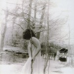

artist: **United Bible Studies** release: _The Shore That Fears The Sea_ format: CD year of release: 2006 label: [Deserted Village](http://www.desertedvillage.com/) / Deadslackstring duration: 47:14

detailed info: [discogs.com](http://www.discogs.com/United-Bible-Studies-The-Shore-That-Fears-The-Sea/release/1437667)

**United Bible Studies** is one of Ireland's leading freefolk ensembles, combining experimentation with ambient and more traditional folk. Compared to previous releases since the band's inception in 2001, _The Shore That Fears The Sea_ is more of a 'studio album', with a greater emphasis on songwriting.

This makes the album very diverse and more accessible, while remaining original. Each song has its own distinct character, so the album contains a wide range of sounds. "Rivers Rotting In The Earth" is an introductory mix of sound manipulation, guitar, flute and spoken word, exemplary of the **United Bible Studies** experimental style. But, other songs on the album sound like they could come straight from the repertoire of a related project. "Hellical Rising", a fragile little song, could just as well be from**The Magickal Folk of the Faraway Tree**, whereas "Columba's Song" wouldn't sound out-of-place on one of Dave Colohan's recent **Agitated Radio Pilot** albums. "Watching The Rain Reshape Galway" takes things in a different direction, though. One this beautiful track, Dave's soaring vocals steal the show. The rest of the album shows a similar mix of beautiful melodies, ambient and musical experiments. I won't go into further detail, save mentioning the wonderful title track, a long modern folk song with a great flute and clarinet duet at the end.

Together with the great pictures in the booklet, this makes for a very succesful release, and it comes warmly recommended to all lovers of modern folk and experimentation.

Reviewed by **O.S.**

Tracklist:

1\. Rivers Rotting In The Earth (6:16) 2. Hellical Rising (2:16) 3. Columba's Song (2:53) 4. Watching The Rain Reshape Galway (7:15) 5. Crofts Of Copeland (2:20) 6. Tributaries Of The Styx Under Dublin (7:03) 7. The One True God Lies To Himself While The One True Goddess Sings (7:09) 8. The Shore That Fears The Sea (7:57) 9. Captain William Coey (4:05)
