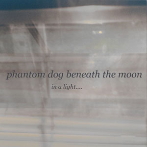

artist: **Phantom Dog Beneath the Moon** release: _In a Light...._ format: CD-R, MP3 year of release: 2004, 2005 label: [Deserted Village](http://www.desertedvillage.com/) (CD-R), Woven Wheat Whispers (MP3) duration: 48:49

**Phantom Dog Beneath the Moon** is described best as sad, eerie acoustic guitar folk with electronic effects. _In a Light...._ conjures up images of nightly walks through misty, abandoned streets. Of man looking for solace in a crowded, hectic world.

On this first CD, **Phantom Dog...** immediately succeeds in presenting an atmospheric style of its own. This is mostly because of the combination of acoustics and electronics. Most tracks are guitar songs with vocals, but there's also a couple of purely ambient tracks (the two parts of "Eerie Night Falls"), and the last track is very experimental. This makes for a varied album that also has enough consistency. The many-sided voice of Aaron reminds one, when high-pitched, of **Radiohead**'s Thom Yorke, which is clearly audible at the end of "After The Dark". This isn't disturbing to me, because the music provides **Phantom Dog...** with a distinct atmosphere.

_In a Light...._ is an album that appeals to me, and at some moments, really manages to touch me, like in the catchy "Dreams Look Like Reality" and the introspective "For Fear, Look Outside". Nevertheless, there's something missing. There's isn't a single bad track on this album, but there are too few moments that _truly_ impress me. Too little of this record hangs around in my mind when it is done, and that is a pity, because the concept has a lot of potential. Despite these lesser points, this is a quality album, that I'd recommend to anyone who loves introspective and estranging folk. I'll definitely be looking forward to new **Phantom Dog...** material.

Reviewed by **DMK**

Tracklist:

1\. Nighttime (4:46) 2. Blue Velvet Lullaby (4:56) 3. Eerie Night Falls part 1 (2:01) 4. Alive With Taut Weary Eyes (6:32) 5. Dreams Look Like Reality (3:27) 6. For Fear Look Outside (6:48) 7. Eerie Night Falls part 2 (1:57) 8. After the Dark (6:25) 9. City of Stars (4:35) 10. I'm Not Sure (7:22)
