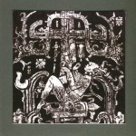

artist: **United Bible Studies** release: _The Northern Lights and The Northern Dark_ format: 3″ CD-R year of release: 2006 label: [Rusted Rail](http://www.rustedrail.com/) duration: 18:53

detailed info: [discogs.com](http://www.discogs.com/United-Bible-Studies-The-Northern-Lights-And-The-Northern-Dark/release/1425455)

This is another one of those really cute 3″ CD-Rs that pop up now and then in the alternative folk underground, this time by **United Bible Studies**, but again on Irish label **Rusted Rail**. One of the nice parts about this format, cuteness aside, is that because of the limited duration, you really get to focus on a release, being able to play it again and again in a short period.

That's certainly time well spent with this excellent **United Bible Studies** EP. Like [_The Shore That Fears The Sea_](http://www.eveningoflight.nl/2006/10/01/review-united-bible-studies-the-shore-that-fears-the-sea-2006/ "Review: United Bible Studies – The Shore That Fears The Sea (2006)"), which also appeared this year, _The Northern Lights and The Northern Dark_ (what a title!) showcases the broadness of this band's sound. These six tracks are a mixture of live outtakes and studio tracks. The improvisational style, which these people pull off superbly, is nicely illustrated by "Bubble of Earth" and "Elbow of Dawn", both captivating and honest instrumental tracks. But the band can also write songs, as proven by "Hedge School Drop Out" and the sweet - but mind the stinging lyrics! - "Pictures of Katia". "Note of Hope" starts out as an improv piece for wordless voice and instruments, and fades into another improvisation with guitar, drums and flute. But, as the cliché goes, the best is saved for last. "Spoon of Haar", recorded live in 2005, is a song woven together of several distinct voices. I hear at least Dave Colohan displaying his considerable talent, along with Aaron of **Phantom Dog Beneath the Moon**. With minimal instrumental backing in the form of a soft drone, these men put down an extremely touching melancholic piece of vocal art. "Haar" means a special type of fog in a certain Scottish dialect, and it's a well-chosen title, for this song would go along perfectly with a teary gaze upon mist drawing closer towards you over the hills.

For a mish-mash of songs, _The Northern Lights..._ is a pretty sound release, and it forms the perfect little companion to the equally excellent full length album from this year. Once again, **United Bible Studies** prove to be one of Europe's finest when it comes to freefolk.

Reviewed by **O.S.**

Tracklist:

1\. Bubble of Earth (2:58) 2. Pictures of Katia (1:49) 3. Note of Hope (4:14) 4. Hedge School Drop Out (1:23) 5. Elbow of Dawn (2:37) 6. Spoon of Haar (5:52)
