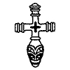

November 10th 2006 - by Quietus

_"Behind the priest-slaying bogeyman lies a developed, civilised people who beg for proper, impartial study after these long years of pseudo-historical exile."_

"Lo, it is nearly 350 years that we and our fathers have inhabited this most lovely land, and never before has such terror appeared in Britain as we have now suffered from a pagan race, nor was it thought that such an inroad from the sea could be made. Behold, the church of St. Cuthbert spattered with the blood of the priests of God, despoiled of all its ornaments; a place more venerable than all in Britain is given as a prey to pagan peoples."

_\-Bishop Alcuin, Letter to Ethelred, King of Northumbria (extract)_

It is a well known piece of history. On the 8th June, 793 CE [\[1\]](#1), the first of a series of coastal raids from Scandinavia struck the Holy Island of Lindisfarne. The wild pagan raiders unleashed a previously unimaginable terror on the peaceful monks. Simeon of Durham writes in his _Historia Regum Anglorum et Danicorum_: "\[The Vikings\] came to the church of Lindisfarne, laid everything waste with grievous plundering, trampled the holy places with polluted steps, dug up the altars and seized all the treasures of the holy church. They killed some of the brothers, took some away with them in fetters, many they drove out, naked and loaded with insults, some they drowned in the sea... It was 400 years until Lindisfarne regained its past glories, long after the end of what historians came to call ‘The Viking age’ (793 CE – 1066 CE). In that time, countless other attacks would shake the coasts of Britain and France. Viking raiders would penetrate even into the Mediterranean as they unleashed a reign of terror: raping, pillaging and slaughtering with uncaring abandon and an anathemic hatred of Christianity.

At least, this is what the chronicles tell us. Contemporary accounts are abuzz with the atrocities of the northmen. "Summa pia gratia nostra conservando corpora et custodita, de gente fera Normannica nos libera, quae nostra vastat, Deus, regna" runs a religious litany of the period: "Our supreme and holy Grace, protecting us and ours, deliver us, God, from the savage Northman race which lays waste our realms": one of many possible sources for the infamous, more succinct, but almost certainly apocryphal ‘Fury litany’, ("A furore Normannorum, libera nos Domine" – "From the fury of the Northmen, O Lord, Deliver us!") quoted so freely in many books and articles on the subject. Europe almost leaps from the Dark Ages of historical uncertainty with chronicles, accounts and letters detailing the depredation of the Vikings.

It is all so clearly laid down, that until the mid twentieth century it was mostly taken as fact: most of our history of the Vikings, and indeed the very concept of the Viking age, comes from these documents, and the works of mainly nineteenth century scholars. It is only comparatively recently that revisionist historians have stopped accepting these sources at face value, indeed, when one thinks for an instant, there are some things that do not add up. Alcuin’s letters, to the King of Northumbria and the Bishop of Lindisfarne, are the only contemporary sources for the raid. If the fact that, despite the raids severity, there still was a Bishop of Lindisfarne for Alcuin to write to does not make us ask ourselves some questions, then the place that Alcuin sent his letters from should. For the single contemporary account of the sacking of Lindisfarne was written by Alcuin whilst he was at the court of King Charlemagne in Aachen, over 500 miles away. It is, in fact, agreed by a growing number of revisionist historians to be little more than propaganda, an opinion which requires us to undo the major mistake of earlier historians in attempting to understand the history of Scandinavia and its place in Europe and the wider world at this time, which is to view it as somehow apart from the rest of Europe. For the location of Alcuin at the time he wrote his famous letters is significant for two reasons, and our erroneous view of the Vikings cannot be unbound from Alcuin’s perception of the Saxons.

In 775 CE Charlemagne had launched full-scale into a bloody war to conquer and, more importantly to our purposes, Christianise the Saxons. The brutality of this conflict cannot be underestimated. The Saxon nobility submitted to an alliance with Charlemagne and a series of mass baptisms culminating in 777 CE after a succession of successful campaigns by Charlemagne. However, the Saxons did not hold fast to their word, and not only continued worshipping their own gods, but executed a series of uprisings against Charlemagne throughout the rest of the eighth century (They would only be quelled in 804 CE). Charlemagne responded ruthlessly against such oath-breaking and apostasy with mass executions of prisoners and by laying waste to the Saxon’s sacred groves. The Saxons in turn began burning churches in retaliation. Aachen was Charlemagne’s base for waging this war, and the proximity of Alcuin to this conflict can be seen on the map below:

Why is this of importance? There are two reasons: first, Saxons being driven north by the conflict into Denmark and the Scandinavian peninsula may have been one of the instigators of the Viking age. But more importantly, historians such as Prof. Janet Nelson have highlighted the fact that the prejudices of contemporary chroniclers such as Alcuin in their view of ‘pagan races’ and ‘northmen’. If we consider matters for a moment, it is no wonder that Alcuin’s mind instantly jumped to images of church desecration and murder: he was tarring all pagans with the same brush. There is no archaeological evidence that the Vikings did anything more than steal Lindisfarne’s silver and gold (and why should they have any respect for Christian symbols, or even comprehend them, being at this time still Pagans?) There are no mass graves to suggest the wanton murder of holy men, and no evidence of burning. The main source is Alcuin, whose authority in the matter can be likened to that of a journalist reporting on casualties in the battle of Stalingrad from Berlin, with no other information but that ‘there is a battle happening in Stalingrad’. A staunch supporter of Charlemagne’s Christianising mission, it is highly likely that Alcuin embellished his report to a lesser or greater extent. And here I must state the conclusion I have come to personally in my research: the Vikings, such as they existed, were indeed coastal pirates and traders; indeed, the word ‘Viking’ came to English in the 18th century from a Scandinavian word meaning only those who engaged in such activities (In Medieval usage ‘Viking’ referred to a pirate, rather than to any culture; when the Vikings had left their boats behind, they were no longer called Vikings), pre-loaded with Romantic connotations. However, these Vikings have, along the way, been loaded with a reputation for extraordinary brutality that has no real basis in fact. Particularly from the traditional British standpoint, the Vikings have been in a curious position of being romanticised and demonised, whilst Scandinavian nations and later even Nazi Germany, would mix history, hearsay, folklore and mythology into the so-called ‘national romance’ movement, further muddying the waters. The basis for this vast historical misconception, it would seem, is the accepting at face value of not only contemporary chronicles, but many of the sagas and earlier historical studies of dubious provenance and purpose.

The Sagas are literary works written down mainly in Iceland between 1180 and 1400. They fall into five rough categories: Legendary Sagas (_Fornaldarsögur_), Icelandic Sagas or family sagas (_Íslendingasögur_), Kings Sagas (_Konungasögur_), Chivalric sagas (_Riddarasögur_) and Bishops sagas (_Byskopasögur_). Of these five, the Kings sagas, particularly _Heimskringla_ (“The Orb of the World”) a collection of 16 sagas by Snorri Sturluson present us with the most accurate historical information about the period in question: Though the _Heimskringla_ starts in legend, with the quasi-mythic Swedish House of Ynglings, it then goes on to detail the reigns of more historical Norse monarchs, chiefly Olaf Haraldson, and is well regarded as a historical source: even in this work, it is hard sometimes to tell what is fact and what is fable. Its historicity can be attributed in the main part to the recent nature of the events its later passages describe: other sagas, particularly the _Íslendingasögur_, are separated from the period which they narrate by some 200 years or so (they are concerned with the so-called saga age (_sögu-öld_), which took place from ca. 950-1050 CE and are written down some time between 1220 and 1400 CE): in these cases the accuracy of the retellings must be questioned, though in most cases these sagas only deal with events in Iceland itself, and are thus of little use when discussing wider history. Some of them are intrinsically more relevant than others. _Egils saga_, the story of the family of Egill Skallagrímsson and his descendents, is, for example, a bloody tale from whose pages are often plucked tales of Viking atrocity. Egill was a notorious rebel and pirate, said to have made his first murder at the age of seven, and who by his death had amassed a horde of dishonourably obtained silver. Similarly _Jómsvíkinga saga_ deals with the exploits of the notorious Jomsvikings – famed for their heroism and bloodthirsty nature. The mistake in this instance is to read these sagas as a typical story of 10th century Viking life. It has instead been suggested that Egill’s story was recorded not because it was typical, but because it was unusual, and indeed sensational: it would be just as illogical to suppose that the story of Dr. Crippen would indicate a marked tendency toward murdering ones wife in Edwardian Britain. We have even have a possible explanation for Egill’s sociopathic behaviour: Jesse Byock has advanced the theory, based on a careful study of the saga, as well as later historical evidence, that Egill may have suffered from Paget’s Disease, a bone condition that would have caused him almost constant low-level pain. As for the _Fornaldarsögur_, it should be relatively clear the amount of historically accurate information they contain simply from their name: however, particularly during the time that National Romance was gaining popularity in the Scandinavian countries they were studied and accepted to a much greater level, and though they have nowadays, apart from the very last sections of the Hervarar saga, among others, been discredited as sources of historical information, and have also had interest directed away from them by the connotations of National Romanticism following the Third Reich, much of their base imagery has infiltrated into the popular canon of Viking history, further muddying the already murky waters of history. It is from this period that many of the most false and enduring pieces of Viking apocrypha come: The horned helmet, the skull cup, the rite of the blood eagle [\[2\]](#2) and many individual tales.

Archaeology has told us a story of the Vikings somewhat different to that spun by the, as we have seen, unreliable documentary sources. Unfortunately, archaeological evidence for the Viking age is relatively scarce. Scandinavian architecture of this period made almost exclusive use of turf, wood and other natural materials, which have only survived in a very few instances and in limited ways. Most often, the Vikings of this period must be examined through their artefacts, which often give us a picture at odds with the normal historical picture. In York, for example, Pagan and Christian artifacts have been found alongside each other, preserved in anoxic wet clay, making the common held view of a deep hatred between the two faiths seem unlikely. Indeed, other archaeological finds have gone further, and we even see artifacts like the Wolf’s Cross (right), a synthesis between the Crucifix and Thor’s Hammer, which indicates a much easier level of cultural exchange than the simplistic picture of church burning and forced conversion, which we have already seen fits more with the Saxons than with any Scandinavian peoples. A further clue is the type of artifacts most commonly found: not swords, or axes, but combs, used by both men and women regularly at the time, a fact which rather contradicts the idea that Vikings were unusually dirty and unwashed. (This stereotype, by the way, is based to a good degree on a misreading of Ibn Fadlan’s account of his time amongst the _Rus_ [\[3\]](#3). The references Fadlan constantly makes to ‘filth’ and ‘impurity’ are more to do with traditional Islamic concepts of cleanliness, such as the unclean left hand, rather than general uncleanliness. Indeed, it is somewhat remarkable for the time that the Rus washed every day, even if they did share the basin.) Many Viking archaeological sites contain no weapons at all, merely brooches, needles, coins and other examples of an every day existence. Other finds at York indicate that in the 10th Century the town was trading as far afield as the Byzantine Empire, a fact supported by massive finds of Arabic coins in Gotland. Trading, but not raiding.

But the real key to the misunderstanding of ‘Viking age’, as we have seen, is that it exists only as a descriptive term for a range of activities which has, then, become a general description of a group of individuals, rather than a race or nation. Whilst we can speak of ‘Anglo-Saxon Culture’ with reference to an integrated sense of national identity we cannot speak of ‘Viking’ culture, or ‘Viking’ art, in such a way. Viking was merely a lifestyle practiced by some Scandinavians. The term has further become complicated by being overlaid with interpretations from the 18th and 19th centuries which speak more about the cultural preconceptions of the peoples of those times than they do about medieval Scandinavia. The men who recorded the sagas were not fearsome warrior poets, but sedate Christian farmers, trying to get a touch on a more heroic age and answer important questions about their society. When we talk of ‘Viking history’ we really mean a little archaeology coloured by the desires of later generations to ‘remember’ their ancestors as hairy heroes in horned helmets.

We have seen then that our view of the Vikings is based on three distinct sorts of sources: historical texts, the historiographical interpretations of these texts, and the archaeological evidence. We also see that in our common understanding of the Vikings our view has been weighted far too readily towards the first two. We have approached the Vikings with a conception formed already in our heads by eighth and ninth century propaganda and the nationalistic and romantic ends of the eighteenth and nineteenth century ‘Norse Renaissance’ movement, which put little store in the dull but un-fanciful family sagas (once described by William Paton Ker as "among the dreariest things ever made by human fancy") but instead constructed a false history based on the deeds and ideals of heroes who were, at the most semi-mythical, if not completely fictitious. When we peel away these layers of often wilful misinterpretation we see a time more complex, more enigmatic, and, maybe most importantly, a bit less exciting than the one we imagined. And this, surely, is the reason for the continuing power of these baseless myths and stereotypes: the horn helmeted warrior-poet is something exotic, something awesome in his berserk fury, whereas a trader or sheep farmer is just all too normal. Our own desire for romance, shaped by centuries and crystallised by Hollywood, has blinded us to the basic reality of history and obscured what may ultimately be a much more fascinating and nuanced picture of a people highly accomplished in art, craftsmanship, shipbuilding, navigation, literature and a host of other skills. As Else Roesdahl writes: "The picture of a barbaric North is no longer valid. It was created partly on the basis of written sources, and partly on the ideological grounds that European culture, classically inspired and Christian, was ‘superior’." Behind the priest-slaying bogeyman lies a developed, civilised people who beg for proper, impartial study after these long years of pseudo-historical exile.

Notes:

\[1\] C.E. = Common Era; AD \[2\] Ronald Hutton, in ‘The Pagan Religions of the Ancient British Isles: Their Nature and Legacy’ writes "the hitherto notorious rite of the 'Blood Eagle,' the killing of a defeated warrior by pulling up his ribs and lungs through his back, has been shown to be almost certainly a Christian myth resulting from the misunderstanding of some older verse." (p. 282) \[3\] _Rus_ is a name for the (Swedish) Vikings who, during their explorations, sailed up the Dnjepr and other rivers, through Russia, to the South East. This is also where the name Russia comes from.

Recommended reading:

**Hutton, Ronald** “Religions of the Ancient British Isles: Their Nature and Legacy” (Bristol, 1991).

**Magnusson, Magnus**, “Vikings!” (London, 1980).

[http://www.bbc.co.uk/history/ancient/vikings/](http://www.bbc.co.uk/history/ancient/vikings/) [http://www.jorvik-viking-centre.co.uk/trialsplash2.htm](http://www.jorvik-viking-centre.co.uk/trialsplash2.htm) [http://www.viking.ucla.edu/](http://www.viking.ucla.edu/) [http://en.wikipedia.org/wiki/Jorvik](http://en.wikipedia.org/wiki/Jorvik) [http://en.wikipedia.org/wiki/L%27Anse\_aux\_Meadows](http://en.wikipedia.org/wiki/L%27Anse_aux_Meadows) [http://en.wikipedia.org/wiki/Leif\_Ericson](http://en.wikipedia.org/wiki/Leif_Ericson) [http://en.wikipedia.org/wiki/Norse\_saga](http://en.wikipedia.org/wiki/Norse_saga) [http://en.wikipedia.org/wiki/Viking](http://en.wikipedia.org/wiki/Viking)

Complete list of sources:

Books:

Árni Böðvarrson, ed., “Íslenzk orðabók” (Reykjavik, 1980)

Byock, Jesse L. “Viking Age Iceland” (London and New York, 2001)

Cardew, Philip W., “Genre, History and National Identity in Icelandic Saga Narrative” (Leeds 1996).

Hutton, Ronald “Religions of the Ancient British Isles: Their Nature and Legacy” (Bristol, 1991).

Magnusson, Magnus, “Vikings!” (London, 1980).

Montgomery, James E. trans., “Ibn Fadlan and the Rusiyyah” in Bell, Joseph Norment ed., “Journal of Arabic and Islamic Studies Vol. 3” (Edinburgh, 2000).

Roesdahl, Else, “The Vikings”, in Margeson, Susan M. and Williams, Kirsten trans. (London, 1991).

Simon of Durham, “Historia Regum Anglorum et Danicorum”, (Durham, circa 1129) in F.J. Tschan trans. (New York, 2002).

Whitelock, Dorothy ed., “English Historical Documents c.500-1042” (Oxford, 1979).

Weber, Gerd Wolfgang “The decadence of feudal myth: towards a theory of riddarasaga and romance” in Lindow, J, L. Lönnroth, G. W. Weber eds., “Structure and Meaning in Old Norse Literature” (Odense, 1986).

Whaley, Diana “Heimskringla: an introduction” (London, 1991).

Documentaries:

‘Evidence of Vikings’, Timewatch (BBC, 1995)

Websites:

[http://www.arthritis.ca/types%20of%20arthritis/pagets/default.asp?s=1](http://www.arthritis.ca/types%20of%20arthritis/pagets/default.asp?s=1) [http://www.bbc.co.uk/history/ancient/vikings/](http://www.bbc.co.uk/history/ancient/vikings/) [http://www.catholic-forum.com/saints/ncd00287.htm](http://www.catholic-forum.com/saints/ncd00287.htm) [http://itsa.ucsf.edu/~snlrc/britannia/lindisfarne/lindisfarne.html](http://itsa.ucsf.edu/%7Esnlrc/britannia/lindisfarne/lindisfarne.html) [http://www.georgetown.edu/faculty/ballc/oe/widsith-trans.html](http://www.georgetown.edu/faculty/ballc/oe/widsith-trans.html) [http://www.jorvik-viking-centre.co.uk/trialsplash2.htm](http://www.jorvik-viking-centre.co.uk/trialsplash2.htm) [http://www.pc.gc.ca/lhn-nhs/nl/meadows/index\_e.asp](http://www.pc.gc.ca/lhn-nhs/nl/meadows/index_e.asp) [http://www.thenortheast.fsnet.co.uk/Lindisfarne.htm](http://www.thenortheast.fsnet.co.uk/Lindisfarne.htm) [http://www.trin.cam.ac.uk/sdk13/sdkmisc/ehdlist.html](http://www.trin.cam.ac.uk/sdk13/sdkmisc/ehdlist.html) [http://www.viking.ucla.edu/](http://www.viking.ucla.edu/) [http://en.wikipedia.org/wiki/Jorvik](http://en.wikipedia.org/wiki/Jorvik) [http://en.wikipedia.org/wiki/L%27Anse\_aux\_Meadows](http://en.wikipedia.org/wiki/L%27Anse_aux_Meadows) [http://en.wikipedia.org/wiki/Leif\_Ericson](http://en.wikipedia.org/wiki/Leif_Ericson) [http://en.wikipedia.org/wiki/Norse\_saga](http://en.wikipedia.org/wiki/Norse_saga) [http://en.wikipedia.org/wiki/Viking](http://en.wikipedia.org/wiki/Viking)
