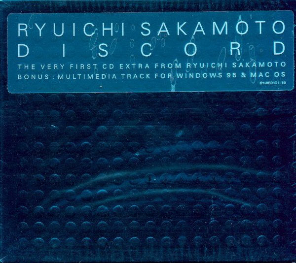

artist: **Ryuichi Sakamoto** release: _Discord_ format: CD year of release: 1997, 1998 label: Sony Classical duration: 54:41

detailed info: [discogs.com](http://www.discogs.com/Ryuichi-Sakamoto-Discord/master/52451)

**Ryuichi Sakamoto** is a Japanese composer, who is mainly known from his award-winning film soundtracks (like _The Last Emperor_ and _Merry Christmas Mr. Lawrence_), and his work with the band **Yellow Magic Orchestra**. _Discord_ is a relatively recent solo album, built around a specific concept, where Sakamoto collaborates with **DJ Spooky**, **David Torn** and "The Orchestra".

There are many ways in which one could interpret this album, but our idea is that Discord is about mourning. First comes the honest grief, then the anger that follows, whereafter the letting go begins. The prayer, where one confides his or her powerlessness to a higher entity, and finally salvation, wherein the whole process culminates. Every movement has its own musical theme that is extensively explored and developed, which gives the album great coherence and clarity.

The album starts very peacefully, with the introduction of the main musical theme on strings. This is slowly developed with other instruments, while a dark undertone of double bass is added, and later church bells as well. The violins sound more and more thin, until the melody sinks away into a dark and chaotic piece. "Grief" ends serenely, with a soft new melody for the strings. The movement is a very powerful depiction of grief in all its aspects.

"Anger" is naturally a more aggressive movement. After the peaceful ending of "Grief", we are startled awake immediately by the violent chaos that the orchestra displays. A rage that relentlessly repeats itself, after a while supported by a rumbling snare, which reminds of a train thundering past. Because of the repetition, this song seems to depict a sort of empty rage, a senseless scream out of powerlessness and frustration.

"Prayer" starts with a calm meditation on oboe, after which other woodwinds gently join in, and later on piano, strings and a soft but heavy drone in the background. Here and there, some effects and wisps of guitar can be made out as well. This movement is the most pure, because it exists entirely of a long development of the single peaceful theme, without deviating from it.

The final movement, "Salvation", is not really a fixed concept, as the first three were, but more of a search for what salvation could be. All themes from the previous movements can be heard here, which makes for a nice wrap up of the entire album. However, there are also new elements, among which are recordings of people trying to explain what salvation means to them. It is unclear whether this search can truly be brought to a successful conclusion, for the musical ending is not unambiguously happy, to say the least. It could be depicting a return to chaos, to Discord, but one might as well interpret it as frustration over an unattainable salvation. The possibilities are endless.

Next to the musical side of Discord, there is also a multimedial side. The CD is listenable and viewable in your PC, where it is accompanied by a very worthwhile digital presentation. There is also an official website dedicated to the album, which contains all sorts of extra material: [www.kab.com/discord](http://www.kab.com/discord). Discord is an extraordinarily beautiful album, which does not lend itself easily to comparison with other music on our site, nor with the work of other modern artists, or even Sakamoto's other work. In any case, it definitely deserves a spot here, because it harbours a deep, dark dimension, that should be appealing to anyone with a wide orientation.

Reviewed by **D.M.K. & O.S.**

Tracklist:

1\. Grief (17:37) 2. Anger (5:38) 3. Prayer (17:49) 4. Salvation (13:37)
