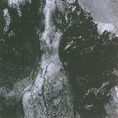

artist: **Itto** release: _Sound on an Empty Road_ format: CD-R year of release: 2006 label: Elvis Coffee duration: 38:47

detailed info: [discogs.com](http://www.discogs.com/Itto-Sound-On-An-Empty-Road/release/1044152)

**Itto** is a project of Neil Rowling (**Goatboy**) and Ian Holloway (**Psychic Space Invasion**). This album is one long track of dark droning ambient, with some field recordings and instruments thrown in. I found this album a bit tough to get into, but it turns out to contain a subtle beauty that does show itself after attentive listening.

The track starts with some very deep layered drones, and this continues on during the first third of the length. More and more sounds of different frequencies drift in during this section, providing variation. About halfway, a soft guitar melody breaks through the drones, which creates a more peaceful atmosphere than the rather dark beginning. Towards the last quarter of the track, nighttime atmospheres and slightly noisy waves take over the lead, sending the track back into cold darkness.

This album requires a quiet environment, headphones and attentive listening, otherwise it won't be able to show its merits. That makes it perhaps a bit limited in its scope, because its not as interesting as background music as some other ambient. However, if you're a patient listener and a lover of deep obscure soundscapes, this is a very fine release. The _real_ sound of an empty road can be interesting enough in the right circumstances, but this musical interpretation is surely worth your attention.

Reviewed by **O.S.**

Tracklist:

1\. Sound on an Empty Road (38:47)
