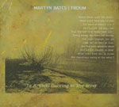

artist: **Martyn Bates | Troum** release: _To a Child Dancing in the Wind_ format: CD year of release: 2006 label: [Transgredient](http://www.dronerecords.de) duration: 38:23

detailed info: discogs.com.

_To a Child Dancing in the Wind_ is collaboration of singer Martyn Bates (**Eyeless in Gaza**, **Twelve Thousand Days**) and German ambient pioneers **Troum** (previously part of **Maeror Tri**). These tracks were conceived in the course of multiple years of editing and sending recordings back and forth. It has proven to be a fruitful effort, as this is a marvellous mini-album that will please both lovers of drifting dark ambient and of Martyn's unique voice.

Now, this isn't the first time Bates has teamed up with an ambient artist. Some may recall the series of _Murder Ballads_ albums (_Drift_, _Passages_, and _Incest Songs_) that Bates recorded with Mick Harris (**Lull**) in the mid-90s. This album is quite different, though. The _Murder Ballads_ were a combination of extremely minimalistic soundscapes, and Martyn's ghostly renditions of traditional songs. _To a Child Dancing in the Wind_ is somehow warmer, more direct, yet still with a dark atmosphere. The soundscapes (based on various instruments such as accordion, bass and balalaika) and vocals seem more in tune with each other, and mutually supportive, creating a beautiful and well-crafted whole.

The album is based on five poems by W.B. Yeats, presented with Bates' usual emotional voice that is immediately recognisable. Opener "Mad As The Mist And Snow #2" is one of the best songs, with a strong buildup of excellent drones based on accordion. But the song is carried by Martyn's vocals and the subtle backing voices of **Troum**. "The Arrow" is a shorter track, with a slightly obscuring effect on the vocals. "The Magi", though based on a poem, is an instrumental with a scary atmosphere, and it is dominated by Martyn's harmonica solo. "I Made My Song" is completely a capella, with only slight vocal effects. Then follows the absolute highlight: the title track. "To A Child Dancing In The Wind" displays best the perfect synthesis of rich soundcrafts, voice and backing vocals. The poem is stunning as well, making this a breathtaking experience. The album ends with an instrumental reprise of the first track, with Martyn playing harmonica instead of singing.

For me, this is an instant classic, and it comes warmly recommended. All I can say is: "more, please..."

Reviewed by **O.S.**

Tracklist:

1\. Mad As The Mist And Snow #2 (12:59) 2. The Arrow (3:49) 3. The Magi (4:55) 4. I Made My Song (2:44) 5. To A Child Dancing In The Wind (4:18) 6. Mad Reprise (9:38)
