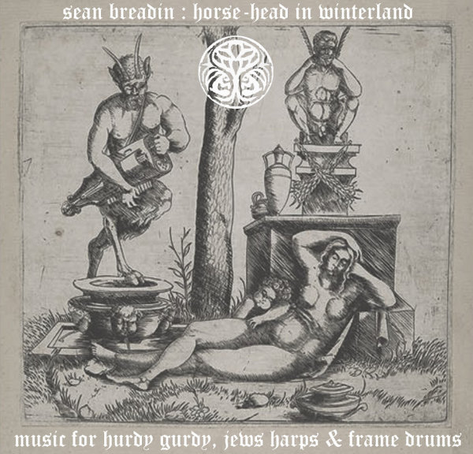

artist: Sean Breadin release: Horse-Head in Winterland format: CD-R, MP3 year of release: 2006 label: [Ploughmyth International](http://www.sedayne.co.uk/) (CD-R), [Woven Wheat Whispers](http://www.wovenwheatwhispers.co.uk/Folk_community/pc/home.asp?idaffiliate=13) (MP3) duration: 70:28

detailed info: [discogs.com](http://www.discogs.com/Sean-Breadin-Horse-Head-In-Winterland/release/912863)

**Sean Breadin** (a.k.a. **Sedayne**) released this album for free in the winter months of 2006/2007, in keeping with the theme of the album. It is now for sale regularly at Woven Wheat Whispers as MP3 and through Plough Myth as a CD-R. _Horse-head in Winterland_ contains over seventy minutes of improvised "music for hurdy gurdy, jews harps & frame drums". Don't expect any melodies or familiar song structures, or even folk - which does sometimes pop up in **Sedayne**'s works - this is totally detached music, often atonal or perhaps 'oriental' to the Western ear, and more like a primordial musical ritual than anything else. If that doesn't scare you, do read on.

As the subtitle suggests, this album centers around the playing of the hurdy-gurdy, jew's harp and frame drum. 'Horse head' is another name for the hurdy-gurdy, because of its shape, and the theme of the album combines the instrument with the season. The combination of these instruments gives a peculiar result, to say the least, but certainly not uninteresting. While this album is quite long, the music is very hypnotic, because of the continuous hurdy-gurdy tones, and especially when the frame drums (bodhrán and a home-made 'damascus square drum') pick up the pace. If you allow yourself to be entranced by these tracks, you're in for an otherworldly journey.

This music is very hard to compare to anything else. While Breadin's project works (like **Venereum Arvum** and **Eleanor's Visceral Tomb**), perhaps come closest, it is still rather different. Therefore, I also find it difficult to recommend this to listeners of any particular kind of music. Let's just say that if you are open towards improvised and strange music played on traditional acoustic instruments, this album is very much worth checking out. But if you value familiarity and a traditional approach to music, you'd best pass this one by. This is not an album that I would play often, as it somehow feels out of place in the context of a modern home. But, at certain times, eyes closed and optionally intoxicated, the horse-head reaches me.

Reviewed by **O.S.**

Tracklist:

1\. terre d'hiver (19:25) 2. janus dans le terre de merveille (4:49) 3. écoutez la roue de la mort (5:56) 4. vieux danser d'homme (7:11) 5. la crâne de glace (7:23) 6. chemin d'hiver avec des pélerins (6:15) 7. winterland (19:29)
