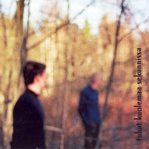

artist: **Tuhat Kuolemaa Sekunnissa** release: _Tuhat Kuolemaa Sekunnissa_ format: CD year of release: 2007 label: [Anima Arctica](http://animaarctica.com/) duration: 35:08

detailed info: [discogs.com](http://www.discogs.com/Tuhat-Kuolemaa-Sekunnissa-Self-Titled/release/1055603)

**Tuhat Kuolemaa Sekunnissa** is a Finnish band consisting of Antti Paavilainen en Mikko Pöyhönen. On this CD, we are presented with neofolk, based on vocals, acoustic guitar and bass. The music is sober and direct, which gives it a style of its own which is not directly comparable to that of others in the genre. This is their debut album and it contains a pleasant mix of up-tempo and slower tracks.

The talent of these guys definitely lies in the writing of catchy tracks, which are probably easy to follow - or even sing along to - for Finns. The CD starts off strongly with "Nukahtaminen", which is nice, also because of the accordion, which gives the track a warm feel. "Vihainen Laulu" also stands out, because of the dynamics between the nice guitar melody and the calm vocals. "Variksenjalat" is a restrained ballad, and it shows **Tuhat Kuolemaa Sekunnissa** also makes beautiful calm tracks. At the end of the album, there is some silence and a hidden track. This is a nice up-tempo song, though sadly with a bad sound quality. The other tracks are also worthwhile.

As said, most tracks consist of only vocals, guitar and bass, with some variety in the instruments here and there, such as the accordion on the first song. It wouldn't have been a bad idea, though, if more instruments or varied percussion would have been used at times. As it is now, it can get a bit monotonous, and tracks do not all stand out. The vocals are clean and rather neutral, except at times when the singer has a catch in his voice, which gives the vocals a bit too much pathos, as in the otherwise good and ominous "Suomalainen Laulu". The lyrics are entirely in Finnish, and I've not been able to find a translation anywhere, so sadly enough, I can't say much about them, except that it sounds rather nice, and I have the idea that cultural heritage and nature play a central role.

**Tuhat Kuolemaa Sekunnissa** also seems a nice band to catch live some time. The music is not very innovative, but it's good. A debut album like this makes me look forward to future material. Recommended to lovers of guitar folk.

Reviewed by **D.M.K.**

Tracklist:

1\. Nukahtaminen (3:05) 2. Saatana Kehäänsä Kiertää (2:47) 3. Vihainen Laulu (2:30) 4. Näkyjä (3:54) 5. Suomalainen Laulu (3:01) 6. Mykkä Mies (2:03) 7. Variksenjalat (3:16) 8. Rauhan Marttyyrit (2:46) 9. Taidat Olla Se Kolkko Vieras (5:07) 10. Juuri (6:39)
