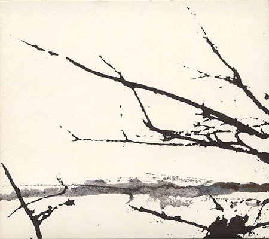

artist: **Tenhi** release: _Väre_ format: CD, LP year of release: 2002 label: [Prophecy](http://www.prophecy.cd/) duration: 57:39

detailed info: [discogs.com](http://www.discogs.com/Tenhi-V%C3%A4re/master/148023)

_Väre_ was **Tenhi**'s second full length album, and one that showed that the band had progressed strongly since _Kauan_ and the _airut:ciwi_ EP. Although those two releases were already rather good, and showed that the band had a unique style, _Väre_ proved that the band was able to refine their skills as musicians and songwriters. The album shows a great variety of moods and sounds, yet it is all unmistakably recognisable as the work of **Tenhi**. To my knowledge, there are few, if any, artists who even come close to the sound of these Finns, perhaps best described in their own words: "folk-influenced progressive music".

The album starts off with the mysterious "Vastakaiun", carried by flute, strings, wonderfully sounding drums, and the typical dirge-like vocals. The more upbeat "Jäljen" shows how naturally **Tenhi** switches between different moods, without sounding out of place. "Vilja" is another beautiful track, with a calm melody richly worked out in guitar and vocals, and a lovely flute solo near the end. And see, there I go again, trying to describe all tracks individually, because they are just so good. A few other parts I just have to name: the eponymous instrumental "Tenhi", which is a beautiful reworking of the track that originally appeared on the _Kertomuksia_ demo from 1997. Then there's the ritualistic tribal sounds of "Varis Eloinen", with the deep harmonious vocals, and hand drums, later dominated by guitar. The album ends with the beautiful "Kuolleesi Jokeen", a representative of the simple but great guitar ballads that band also makes.

I think there's also something magic about the lyrics of the band. To a foreigner, a language like Finnish may easily sound poetic, but the English translations reveal that **Tenhi** is profoundly inspired by elements of nature and weather, as well as melancholic and folk atmospheres. As always, the artwork is fitting, and on this album, for the first time, the band introduced an own take on the booklet. It is small, with white and black print on thick grey paper, displaying both the lyrics and photographs, which gain a unique character through the limited use of colour.

It is safe to say that this is a superb album by what I think is one of the most interesting bands of today. If you're new to **Tenhi** and you are just getting into their latest masterpiece, _Maaäet_, don't forget to look at its predecessor. If you haven't heard the band at all, please do so, and this album will be a perfect introduction. Truly worthy of eclipse status, in short, and highly recommended to everyone.

Reviewed by **O.S.**

Tracklist:

1\. Vastakaiun (7:58) 2. Jäljen (4:54) 3. Vilja (4:59) 4. Keväin (2:24) 5. Yötä (5:26) 6. Suortuva (7:01) 7. Tenhi (6:14) 8. Sutoi (5:54) 9. Katve (3:08) 10. Varis Eloinen (6:37) 11. Kuolleesi Jokeen (3:04)
