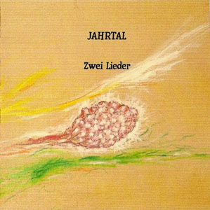

artist: **Jahrtal** release: _Zwei Lieder_ format: CD-R, MP3 year of release: 2007 label: None (CD-R), Woven Wheat Whispers (MP3) duration: 13:58

detailed info: [discogs.com](http://www.discogs.com/Jahrtal-Zwei-Lieder/release/943557)

**Jahrtal** is a neofolk project by Ewald Spiss, from Austria. He has been active in music for many years, with efforts in experimental piano music and soundscapes, among other things. Samples of this material can be found on his website at [www.ewald-spiss.de](http://www.ewald-spiss.de/). Now, after a relatively inactive period, he returns with a this new project and its first release, _Zwei Lieder_. It is released in a very limited CD-R with nice artwork by Ewald himself, or alternatively as a download edition at Woven Wheat Whispers.

This little EP contains two tracks. The first is based on a traditional folk song from Siebenbürgen, and it is gently built up with guitar, banjo, flute and soft layered vocals. The lyrics are symbolic, and are basically about a girl who won't suffer to be forced into the companionship of a certain man. "Abschied" is based on a poem by **Von Eichendorff**, with music by Ewald. It is in the same calm vein of neofolk, also with guitar and banjo, but also joined by the beautifully soft sound of the duduk, a double reed instrument of Armenian origin. The song is very relaxing, and ends with the duduk playing solo.

This is a nice 'debut' of this project, with two calm tracks of neofolk, similar in sound to projects like **Orplid** and **Forseti**. Of course, there is room for improvement, mostly in terms of vocal performance and variation in the music, but I hope this will be better on future releases. And I hope there will be any, because this is a promising project, and I advise lovers of neofolk to keep an eye on it.

Reviewed by **O.S.**

Tracklist:

1\. Es saß ein klein wild Vögelein (4:23) 2. Abschied (9:35)
