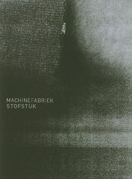

artist: Machinefabriek release: Stofstuk format: Businesscard CD-R year of release: 2007 label: [Self-released](http://www.machinefabriek.nu/) duration: 5:29

**Machinefabriek** is the musical identity of Dutchman Rutger Zuydervelt, and he has carved out quite a reputation for himself in both the Dutch and international scene of experimental electronic music. This is one of the first releases I hear from him, but judging from this and a few other impressions, I can confirm that this positive reputation is very much deserved.

_Stofstuk_ is a true single, released on a business card format CD-R, which is basically a 3" with two bits cut off, reducing the data capacity to a mere 60 MB. Enough to house this one track though, which was composed to accompany a graduation project (art, I take it) of one Yvette Geelen. The track was recorded using only a singing bowl and a vinyl record, and of course recording equipment and digital manipulation.

The track starts with the soft swell of the singing bowl drone, digitally lowered in tone, I think. Soft vinyl crackles accompany it, and multiple layers of drone, still very low in volume, create more space. After a while, the actual high tone of the singing bowl sounds once, and fades away, leaving only the soft drone again. Halfway into the track, there is a twist, and now all elements are combined. We hear both a low and a high pail on the bowl, and the drones and crackles intensify. Near the end of the track, it is as if the bowl doesn't exist itself anymore, but only on the vinyl record, which loops and warps, slowly fading away into silence.

As you may have noticed from this description, _Stofstuk_ is both extremely minimal, but rewarding at the same time, if you have the patience for it, and a quiet atmosphere. Therefore, this is truly something for those who are deep into sound-explorations, because it's not very accessible. If you do have a feeling for such things, this track shows that Zuydervelt has a great talent for this kind of thing. So, if you think you can handle it, it's worth picking up this cheap little single, which is one of a steadily increasing amount of releases by **Machinefabriek**. Rutger is a rising star in the world of aural exploration, and it's also nice to encounter talent from my own country for once.

Reviewed by **O.S.**

Tracklist:

1\. Stofstuk (5:29)
