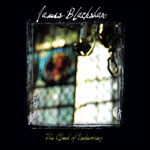

artist: **James Blackshaw** release: _The Cloud of Unknowing_ format: CD, LP year of release: 2007 label: [Tompkins Square](http://www.tompkinssquare.net/) duration: 42:42

detailed info: [discogs.com](http://www.discogs.com/James-Blackshaw-The-Cloud-Of-Unknowing/master/2051)

**James Blackshaw** is back, with a new album on a new label. The wait between _O True Believers_ and this one wasn't very long, but worth it all the same. What we have here is, in my humble opinion, Blackshaw's best work to date. For those who need an introduction, Blackshaw is a young English guitar player, and from the first notes of each of his releases it becomes very clear that this man is a huge talent. The way he handles his 12-string is very impressive, if not awe-inspiring. In most of his compositions, he takes familiar and pleasant sounding tonal combinations from both western and eastern (raga) music, but he plays it in a unique and inimitable way.

The title track is a perfect example of this. James really steps on the gas pedal, compared to some passages from earlier albums, but the result is incredible. The chords and melodies flow like a clear waterfall under his trademark fingerpicking style. It's often hard to believe he plays all this on one guitar track. For this album, however, Blackshaw is not afraid to seek out new territories. "Running to the Ghost", my favourite track of the album, and by Blackshaw in total has support by glockenspiel besides the high-speed (but not nervous!) guitar playing. Halfway we hear something new, but oh so beautiful: the violin sounds of guest musician **Fran Bury**. The perfect touch for a track like this. And then, near the end of side A, James takes us back into that other area of his: experimentation. He never did shy away from an experiment here and there, and this album is no exception. "Clouds Collapse" is a ghostly, sparse piece of experimental melody, played on (de-tuned?) cymbala / lap harp.

"The Mirror Speaks" may well be one of Blackshaw's fastest tracks to date, and it starts with a very thick and loud rumble - that turns out to be the start of James picking his strings! Kind of a rollercoaster of a song, with some interesting and varied twists and turns in the melody. The album ends with the long "Stained Glass Windows", another beautiful track, mostly comparable in style to the first track. Near the end, the wonderful support of Bury's violin joins in again, drawing the album to a beautiful close. However, like the first side, side B ends in experimentation - this time Fran gets free rein in a haunting piece of violin abuse that spans a couple of minutes, demonstrating the seamless blend of acoustic bliss and melodic experiments that is Blackshaw's own.

This is nothing short of a brilliant album, and it shows that James Blackshaw isn't done by far with developing his art. He adds just a touch of difference to the musical blend to make this album stand out from his other work, making it familiar, yet original. _The Cloud of Unknowing_ is available from Tompkins Square on CD and very affordable vinyl, so if you are in anyway interested in fine instrumental acoustic guitar playing or acoustic experiments, this is what you should be getting. Right now.

Reviewed by **O.S.**

Tracklist:

1\. The Cloud of Unknowing (10:55) 2. Running to the Ghost (6:16) 3. Clouds Collapse (3:56)

4\. The Mirror Speaks (6:31) 5. Stained Glass Windows (15:04)
