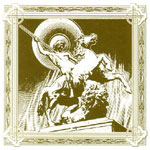
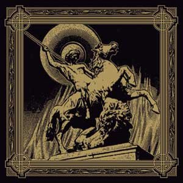

\[caption id="attachment\_1301" align="alignright" width="150" caption="Original Cover"\]\[/caption\]

\[caption id="attachment\_1300" align="alignright" width="150" caption="2009 Re-release"\]\[/caption\]

artist: **Werkraum** release: _Unsere Feuer Brennen!_ format: CD year of release: 2004, 2009 label: [Cold Spring Records](http://www.coldspring.co.uk/) duration: 50:02

[detailed info: discogs.com](http://www.discogs.com/Werkraum-Unsere-Feuer-Brennen/master/95788)

I didn't care much about this so called "neofolk" music that flushed like a wave over Europe some years ago. I had my favorite albums with **Death in June**, **Sol Invictus** and **Current 93**. The new bands that started to pop up were nothing but pale copies for me. I was totally convinced that the experimental folk era had reached its top long ago. And then I heard **Werkraum**. I can't really recall how I first was introduced to them or what it was that made me buy their debut album _Unsere Feuer Brennen!_. It could have been the album's cover art that first took my attention. I still consider this to be one of the most beautiful album covers out there; pretty simple without any text - it truly puts the lion killing horsemen in the centre. But this album is so much more then just a nice cover. It contains 11 of the most true and strong songs that had been released for a very long time.

**Werkraum**'s main brain is in the head of the Berliner Axel Frank. Obviously a very competent musician. He is also backed up by some friends from various bands. Jason Thompkins from **Harvest Rain** and Nick Nedzinsky of **Lady Morphia** fame. There is also a woman in the collective named Antje Hoppenrath. I'll return to these musicians later on.

"Nocturne" is the first song out, a very moody neoclassical song with a deep male speech underneath. It's the only track with English lyrics and the lyrics are actually adapted from a poem by **John Dowland**, but who reads them here is not told. It's a very nice way to open this album. Bombastic and pompous intros can often be rather boring. If they aren't badly composed they are usually far too long to be enjoyable, but "Nocturne" does not suffer from those symptoms at all. After the intro fades out, "Die letzte Jagd" starts, a track written after all unwritten rules of neofolk songwriting together with **Lady Morphia**. Simple guitar playing, snare and tom drums are joined by a trumpet in between the verses. But what makes "Die letzte Jagd" such a remarkable song is both the fact that it has a very catchy melody and Axel Frank who shows that he's not only a great musician but also a splendid singer.

Next up is "Chanson de la plus haute tour". It's a much calmer song, somewhere between psychedelic and medieval acoustic folk. Antje sings a poem by **Arthur Rimbaud** translated into German and this woman has to be properly schooled in singing... What a voice! And WHAT a song! I can’t get enough of this. I can play it on repeat for hours and every time the chorus comes, where Antje and Axel sing in duet, I get pleasant shivers down my spine. For the sake of balance, track four ("Einsamer nie") is quite unremarkable. Swirling organs and twisted voices in a futuristic neoclassical way. The fifth track ("Legion") on the other side is another masterpiece of neofolk, a bit slower than "Die letzte Jagd" but just as good if not even better. The disturbed electric guitar in the background fascinates me. And so does, once again, Alex’s singing.

Now, after five more or less perfect songs, you might believe that the album loses strength. If you do, you are so wrong. "Steh Auf Nordwind" is an instant hit. From the bells in the beginning to the fade out in the end. A perfect neofolk song! If the other songs were catchy I don't know how to explain this one. It relies more on the electric guitar than the acoustic, which was a completely new, but not in any way unpleasant way of playing neofolk for me. You might need some time to melt what you just heard and to do that during "Dignitas Dei" – another of those experimental 'in between' songs without any proper structure and lots of futuristic sounds, is a good idea. Even though this one is better than "Einsamer nie" it still is better seen as a filling between the songs than an actual song of it own. When the previous song is melted you can start preparing yourself for the next attack. "Ewigland" is a collaboration song with **Harvest Rain** and if you have heard **Harvest Rain** before you know what to expect. Very desolate. Makes you feel strange in some way. Jason Thompkins' characteristic guitar playing is backed up by Alex's voice and snare drumming and all this creates another song to remember. Yet another neofolk song follows, "Heilige Krieg", "Hohezeit" – moving more towards the medieval sound with Antje behind the microphone again, and finally the outro "Civitas Dei" with a proud martial feeling to begin with and a spacey drone at the end.

So why does _Unsere Feuer Brennen!_ deserve an Eclipse rating? Simple. It's a masterpiece album. It stays very personal even though the guest artists have left their own traces. A formidable debut release from a band that can take what turn they want and still have my full support and respect. This is the album that made me realize that neofolk is more than the World Serpent oldies and with that opened my eyes to a completely new world of the new wave of dark folk music. 50 minutes and three different styles of the best neofolk sounds in one album makes this a must have for everyone. Thank you.

Reviewed by **CME**

Tracklist:

1\. Nocturne (2:17) 2. Die Letzte Jagd (4:13) 3. Chanson De La Plus Haute Tour (4:04) 4. Einsamer Nie (4:23) 5. Legion (5:50) 6. Steh Auf, Nordwind! (3:33) 7. Dignitas Dei (5:34) 8. Ewigland (4:04) 9. Heilige Krieg (4:46) 10. Hohezeit (3:32) 11. Civitas Dei (7:46)
