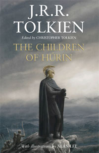
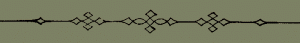
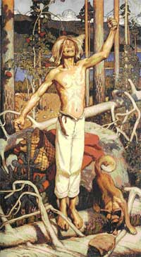

July 27th 2007 - by **O.S.**

> _"A Túrin Turambar turún' ambartanen: master of doom by doom mastered!"_

\[caption id="attachment\_454" align="alignright" width="120"\] 'The Children of Húrin' first edition cover, illustration by Alan Lee\[/caption\]

The annunciation of J.R.R. Tolkien's 'latest' might have evoked mixed feelings for some. I'm probably not the only one who, after living through the huge business that surrounded Peter Jackson's movie depiction of _The Lord of the Rings_, wondered what this newest work, over 30 years after Tolkien's death, would contain, and if it wouldn't be the umpteenth trick up the sleeve of those who are earning money from the good man's literary works. The entire series of _The History of Middle-Earth_, consisting of a very extensive inventory of Tolkien's manuscripts and ideas, is finished, and what then is left, one might ask. _The Children of Húrin_ accordingly, is not a work 'hidden' for years that will cast a whole new light on Tolkien's Middle-Earth. Moreover, experienced Tolkien readers will have quickly caught on that the book is about the tales of Húrin and (in particular) his son Túrin, as told in _The Silmarillion_, and more extensively in _Unfinished Tales_. Those same readers, though, will also know that the version of the story in _The Silmarillion_ is rather concise (about 30 pages) and the one in _Unfinished Tales_ (about 100 pages) rather incomplete and adapted to the style of that book.

This is the reason why Christopher Tolkien, editor of most of his father's posthumous work, has chosen this particular tale for an independent release. As he explains in the notes after _The Children of Húrin_:

> _It thus seems unquestionable, from my father's own words, that if he could achieve final and finished narratives on the scale he desired, he saw the three 'Great Tales' of the Elder Days (Beren and Lúthien, the Children of Húrin, and the Fall of Gondolin) as works sufficiently complete in themselves as not to demand knowledge of the great body of legend known as The Silmarillion__._ (10) [\[1\]](#1)

The goal has been to realise such a self-contained version, which has now been done. By comparing the different versions of the story to be found in J.R.R.'s legacy, Christopher has created a grand whole, which is mainly faithful to the version in _Unfinished Tales_, but with a consistency of style, pace, and content that an independent story demands. The result is a fine book of a little over 300 pages, with enough background information to be able to place the story in the frame of Tolkien's mythology, without distracting from Túrin's adventures. And this is the main forte of the book: for the first time this tragic hero (perhaps Tolkien's most tragic) gets a whole book to himself, without being just another link in the chain of a long history. I will elaborate more on the nature of this epic in the second part of this little article, and that part will also spoil the larger part of the plot. Those who'd rather find out for themselves are therefore advised to skip that part until they've read _The Children of Húrin_ themselves.

That the book is worth the purchase is beyond doubt for me. Because of the abovementioned nature of the story, this book is more like _The Hobbit_ and _The Lord of the Rings_, and less of a background book for those who wish to delve deeply into Tolkien's universe. While the style of the story is rather haughty (like all of Tolkien's works), the story itself is extensively worked out, and therefore more accessible than _The Silmarillion_, which has always remained more for the real Tolkien fanatics. So, even those who've always just sticked to _The Hobbit_ and _The Lord of the Rings_ should give _The Children of Húrin_ a try.

Besides, the story is so different in terms of content, because of its essentially tragic nature, that it definitely shows a new side of Tolkien's work, a side particularly close to classical, Germanic and (as we'll see) Finnish heroic narratives. At the same time, the tale is true to Tolkien's own ceration: _The Children of Húrin_ is firmly rooted in the fantastic but convincing Middle-Earth, and readers of _The Lord of the Rings_ will recognise many elements in this book.

Finally, there are the illustrations. Alan Lee again has delivered a wonderful series of pictures, both colour plates and pencil drawings between blocks of text. For those who, like me, posess a copy of the illustrated edition of _The Hobbit_, this will be familiar. I think these illustrations add a lot to the atmosphere, and it's a good move to equip even the standard first edition of the book with these. In short, this is a beautiful work which'll look great in both the beginning and expert Tolkien library.

**\* What follows is a brief analysis of the story - including spoilers! \***

 Above I wrote that I consider _The Children of Húrin_ one of the stories in which Tolkien comes closest to the heroic tradition of different European peoples. Even a novice reader of this book will recognise that there are many elements in the life of Túrin Turambar (Túrin, Master of Doom) that 'we' (as Westerners) associate with 'heroism'; killing a dragon that threatens the land is probably the most obvious one. Tolkien is inspired by more than just familiar fairy tale motives, however. Woven into the story, that is set into the background of the long, often hopeless struggles between the Elves and the dark god Morgoth, we find elements from both the Germanic and Finnish heroic tradition.

But first, a brief summary of the plot. Húrin is the leader of a house of men, that fights alongside the elven people against the armies of the fallen _vala_ Morgoth. Húrin is married to Morwen, and their son is called Túrin. During the _Nirnaeth Arnoediad_ ('Battle of Unnumbered Tears') Húrin is captured and brought before Morgoth, who curses him and makes him watch from a high mountain how the dark armies spread across the world. After defeat in the battle, Morwen sends Túrin to the elven king Thingol, so that Túrin - now the heir of the house - can grow up in safety. Not long after, Túrin's sister Niënor is born. Túrin is raised by Thingol, but quickly turns out to be born for trouble. All grown up, he causes the death of the elf Saeros after a fight, but he flees before he can be judged. He becomes an outlaw and the leader of a group of bandits. After a meeting with his elven friend Beleg, Túrin decides to only hunt Morgoth's orcs from now on. Fate strikes again, though. After being captured by orcs, Túrin is freed by Beleg, but because he was confused from begin captured, he mistakes Beleg for an orc and slays him by accident. After more wanderings, Túrin ends up in Nargothrond, a fortress of the elves. There he becomes the counsellor of king Orodreth, and the blade of Beleg is reforged. Morgoth did not sit idly, however, and sends Glaurung, greatest of dragons, into the world. Glaurung lays waste to Nargothronf, but Túrin escapes and is again alone in the wilderness. There he meets his sister Niënor, who had earlier been bewitched by Glaurung, and had lost all of her memories. The two don't recognise each other (he had never seen his sister before) and fall in love and marry. Glaurung is still scourging the land, however, and Túrin sets out to defeat him. He succeeds in slaying the dragon, but is smitten by the dragon's poisonous blood, and falls in a death-like trance. Everyone thinks he has died, and Niënor is stricken with grief at the sight. At that moment, the dying Glaurung lifts the bewitchment. Niënor has regained all her memories, and she realises she has had an incestuous relationship. A broken woman, she casts herself off a cliff. When Túrin wakes up, he is told all that had come to pass, and he too, is broken. He takes his own life by throwing himself onto his sword.[\[2\]](#2)

Besides writer, Tolkien was also a philologist, and as a scholar of Old English and other Old Germanic languages, hij was surely familiar with the tales surrounding the hero Sigurd (German: Siegfried). Sigurd was the slayer of the dragon Fafnir, as is told, among other places, in the _Völsunga saga_ and the _Poetic Edda_. Like Túrin, Sigurd kills the dragon from below, but the similarities don't stop there. Another motive, for example, is the magical power of the dragon's blood. Glaurung's blood is poisonous, while Fafnir's grants impenetrable skin. But perhaps most important is the sword. Sigurd fights with the sword Gram, which he has inherited from his father Sigmund. Sigmund's blade had broken at his death, but he was able to bequeath the two pieces to his wife Hjördis, to keep them safe for Sigurd. Later, the blade is reforged and it becomes a formidable weapon, capable of cleaving a flock of wool in two, or as it happens, a dragon's belly. Túrin's sword, Gurthang ('Iron of Death') has a different background, but a similar fate. Túrin's friend Beleg Strongbow posessed a blade called Anglachel ('Iron of the Flaming Star'), but when he freed Túrin, he accidentally pricked him with it. Túrin was still confused from being captured, and it was night, so he thought Beleg was an orc come to torture him. When he came loose, he grabbed Anglachel and slew his best friend. The blade he later had reforged to Gurthang. This is a very clear parallel, and one of the first in the book that places _The Children of Húrin_ clearly in a historical literary tradition. But there is more in the Sigurd-cycle that is familiar. Sigurd's father Sigmund has inadvertedly conceived a child (Sinfjötli) by his own sister Signy, who, magically disguised, shares the bed with him one night. [\[3\]](#3)

")

\[caption id="attachment\_455" align="alignleft" width="120"\] Aleksi Gallen-Kallela's 'Kullervo Cursing' (1899)\[/caption\]

We also find this incest motive in the Finnish songs on Kullervo [\[4\]](#4), as collected in the _Kalevala_. Kullervo is Kalervo's son, the latter of whom was caught in a feud with his brother Untamo. Kalervo's family is exterminated, but Kullervo's mother is captured by Untamo, in whose land she gives birth to Kullervo. Untamo tries to kill the boy, but fails, and sends him into slavery instead. Later, Kullervo finds his parents again, who turn out to be alive, even though his sister has gone missing. During one of his travels, he meets her, but they do not recognise each other. He seduces her, and they make love. Afterwards, they inquire after each other's family, and they discover that they are siblings. She is beyond grief, and throws herself in the river ( like Niënor). Kullervo as well is broken, and after avenging his relatives on Untamo, he takes his own live by casting himself on his own sword. And here we can of course recognise Túrin's final moments. After he discovers he married his own sister, he asks Gurthang if it is willing to take his life. The sword speaks:

> _"Yes, I will drink your blood, that I may forget the blood of Beleg my master, and the blood of Brandir slain unjustly. I will slay you swiftly."_ (256)

These are telling similarities, which show that Tolkien often drew from different wells in the history of European literature, also in his other works. He did not keep it a secret, by the way, as he points out the link with Sigurd and Kullervo himself in his letters. [\[5\]](#5) It's clear that Tolkien considered himself part of rich tradition of storytelling. By taking motives from older epics and working them into his books, he emphasises that position, and anchors his stories in it. This tradition is not (only) about originality, but also about expressing culturally relevant concepts like heroism and fate. These two in particular are important in the story of Túrin. After many hardships and grief, he starts calling himself Turambar, Master of Doom. His Doom was still to come, however, and this typical act of hybris becomes his downfall. Whether it's Morgoth's curse on Húrin's bloodline that catches up with Túrin or not isn't clear, but the end of the book makes it painfully clear that even Túrin cannot escape his Doom. How true the words of Niënor, spoken when she last laid eyes on his body:

> _"Farewell, O twice beloved! A Túrin Turambar turún' ambartanen: master of doom by doom mastered! O happy to be dead!_ " (243-244)

Notes:

\[1\] All quotes are from _The Children of Húrin_, see list of sources. \[2\] See for a slightly more elaborate summary [http://en.wikipedia.org/wiki/T%C3%BArin](http://en.wikipedia.org/wiki/T%C3%BArin). \[3\] The _Völsunga saga_ is readable online in English on [http://omacl.org/Volsunga/](http://omacl.org/Volsunga/). \[4\] The story of Kullervo can be found in _runo_ 31-36 of the _Kalevala_. For a further comparison of J.R.R. Tolkien's work and that of Elias Lönnrot, the collector and editor of the _Kalevala_, see Petty (2004). \[5\] See Carpenter & Tolkien, _Letters_, p. 150.

References:

- **Carpenter, Humphrey & Tolkien, Christopher (eds.)** (1981 \[1995\]). _The Letters of J.R.R. Tolkien_. London: HarperCollins.
- **Tolkien, J.R.R.** (1980 \[2000\]). _Unfinished Tales of Númenor and Middle-Earth_. London: HarperCollins.
- **Tolkien, J.R.R.** (1977 \[1998\]). _The Silmarillion_. London: HarperCollins.
- **Tolkien, J.R.R.** (2007). _The Children of Húrin_. London: HarperCollins.
- _Kalevala. The Land of the Heroes_. Translated by W.F. Kirby (1907 \[1969\]). London, New York: Everyman's Library.
- **Petty, Anne C.** (2004). "Identifying England's Lönnrot". In: _Tolkien Studies_ 1. pp. 69-84.
