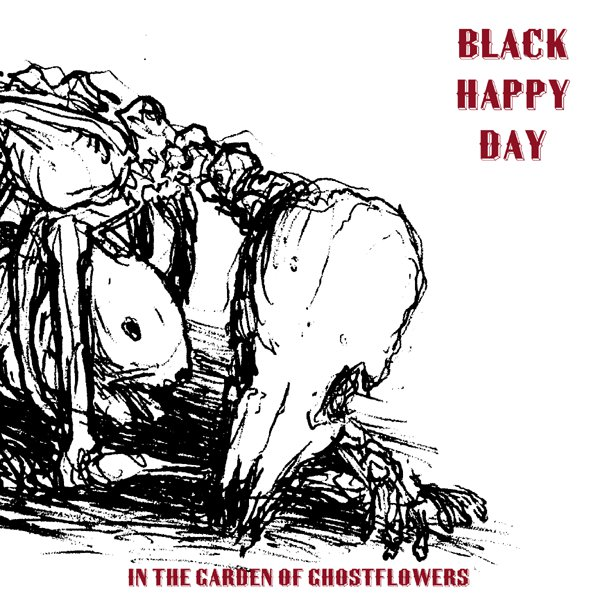
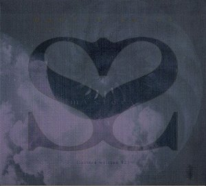

\[caption id="attachment\_866" align="alignright" width="150" caption="Original 1995 Cover"\]\[/caption\]

artist: **Martyn Bates** release: _Mystery Seas (Letters Written #2)_ format: CD year of release: 1995, 2005 label: Ambivalent Scale/World Serpent (1995), [Shayo](http://www.shayo.ch/) (2005) duration: 58:32

detailed info: [discogs.com](http://www.discogs.com/Martyn-Bates-Mystery-Seas-Letters-Written-2/master/150589)

**Martyn Bates** has been active as a singer, lyricist and musician since the end of the 1970's. He is most recognised for his work in the alternative rock group **Eyeless in Gaza**, and neofolk lovers might know him as one half of **Twelve Thousand Days**. Even ambient lovers might know him through his collaborations with people like **Mick Harris** and **Troum**. No matter what kind of music you are here for, chances are Bates has been doing it. Besides all this though, Bates has had an extensive solo career, releasing over ten albums and EPs over the past three decades. And though it is difficult to pick an album from this mostly excellent discography, _Mystery Seas_ is definitely one of his best albums, and a unique one within alternative music in general.

As is always the case, the music revolves around Bates' magnificent voice and lyrics, but the instrumental backing differs from album to album. In this case, he has stripped it down to melodies and waves on organ and synth, eschewing for example the banjo that coloured the following _Imagination Feels Like Poison_ album. The result is a varied collection of songs, sometimes relaxed and dreamy, and sometimes more urgent. Examples of the latter are "Imagination Feels Like Poison" (not to be confused with the album of the same name, which contains - what else - a track called "Mystery Seas") and "You, Looking to Me for a Sign", which both are quite uptempo, with a driving force coming from the melodic backing. The climax of this style is perhaps the excellent "Over the Waters", which combines intense, desperate vocals with an appropriate synth and piano backing.

\[caption id="attachment\_867" align="alignleft" width="150" caption="2005 Reissue Cover"\]\[/caption\]

At the same time, the album has its more calm side, in many different ways. At times melancholic, like on "Everywhere There's Rain", or more dark and brooding, like "Calm of Dark" and "Of Night". But perhaps best are the short, dreamy tracks "Trade Winds" and "Midday Coming Misty". In less than three minutes each, they manage to present most clearly the sublime way Martyn combines voice, melody and words. Despite picking out a few tracks here, the whole album is totally consistent in its quality and emotion, something that truly makes this a great piece of work.

A large part of the lyrics (or rather, poems, because they truly are that) are from the early 80's, hence the subtitle _Letters Written #2_, which refers to Bates' EP from 1982, which contained other lyrics from the same period. In addition there are a few new pieces from around the time of release of this album. All of the writings share a certain level of quality, though. Bates' poetry, like the music, is often melancholic, dreamy, metaphoric, and very good.

Though I hesitate calling this Bates' best album, as they are often quite different and difficult to compare, it's certainly one of the best. It was a good choice by Shayo records to re-release this last year (with new artwork and mastering), as perhaps it will help gain this album and artist a new audience. This is surely deserved, because Martyn Bates sadly remains an under-appreciated singer and artist. Albums like this have a certain timeless quality about them, difficult to categorise, with roots in folk and alternative music. I'd like to compare this album to **Nico**'s solo works. Though both artists have a very different approach and atmosphere, they have in common that they present _song_ in one of its purest forms, and with a dark touch to it. _Mystery Seas_ is a wonderful album that every one of our readers should give a chance.

**Reviewed by O.S.**

Tracklist:

1\. You, Looking to Me for a Sign (5:06) 2. Shorepoem (4:19) 3. Calm of Dark (5:29) 4. Imagination Feels Like Poison (5:18) 5. Trade Winds (2:32) 6. Over the Waters (4:52) 7. Everywhere There's Rain (4:51) 8. Empty Pages (4:28) 9. Midday Coming Misty (2:53) 10. On the Beach at Fontana (2:15) 11. Sky After All (4:53) 12. Fragment (Little Star #1) (1:37) 13. If I Could See in Everyone (3:10) 14. Of Night (5:48) 15. Gift (1:00)
