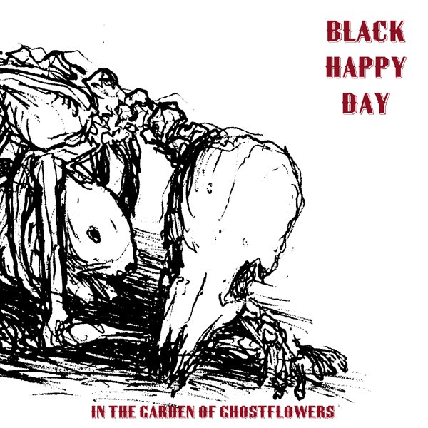

artist: **Black Happy Day** release: _In the Garden of Ghostflowers_ format: CD year of release: 2006 label: [Silber](http://www.silbermedia.com/) duration: 50:52

detailed info: [discogs.com](http://www.discogs.com/Black-Happy-Day-In-The-Garden-Of-Ghostflowers/release/1018422)

**Black Happy Day** is a collaboration of **Tara VanFlower** (**Lycia**) and **Timothy Renner** (**Stone Breath**), and if you know these two artists, you'll have a pretty good idea of what a combination would sounds like. _In the Garden of Ghostflowers_ is a strange and original mixture of traditional song (in wyrdfolk style), cold darkwave, and further experiments. Not your everyday concept, in short, but Tara and Timothy make it work nonetheless.

"The Leaves of Life" starts off the album with the two contrastive voices singing in unison - Timothy's dark and low, Tara's high and clear - both delayed and reverbed. The manipulation of vocals returns often throughout the album, enhancing the ghostly air that hangs about much of this music. The title track introduces the banjo, which provides a backdrop for Tara's voice which now rises in pitch. The third track, however, is different again. "Whore" is a dark, minimal ambient piece, with Tara's manipulated voice approaching the style of someone like **Jarboe**. Very gloomy and atmospheric. This interchanging of styles continues throughout the album, providing a lot of variation.

I won't dissect every song, but some deserve special mention. The traditional "Edward" unites the styles of the first two tracks into a wyrdfolk duet with strange effects lurking beneath the surface. "How many hours 'til the Spider's work is done?" is one of my favourite tracks of the album, a long meditative piece with impressive vocals (once again calling to mind **Swans**), sitar, and a dark layers of bass. The last two tracks end the album on a happier note. "Hand in Hand" is a sweet little duet, while "Be Thou My Vision" is a hopeful devotional song.

_In the Garden of Ghostflowers_ is a very original and varied album. I can't explain why exactly, but for some reason I didn't immediately dig this album as much as I would expect based on the sound and elements used. Nevertheless, this is good stuff, and if anyone is looking for an original approach to modern and traditional song, with a touch of darkwave and dark atmospheres, this is an excellent album to check out.

Reviewed by O.S.

Tracklist:

1\. The Leaves of Life (2:29) 2. In the Garden of Ghostflowers (2:30) 3. Whore (6:48) 4. Edward (4:06) 5. Of the Wind and Loneliness (4:02) 6. Oh How They Weep and Moan (1:28) 7. A Lyke Wake Dirge (4:53) 8. How many hours 'til the Spider's work is done? (9:47) 9. Wolf & Hare (7:20) 10. Hand in Hand (2:56) 11. Be Thou My Vision (4:33)
