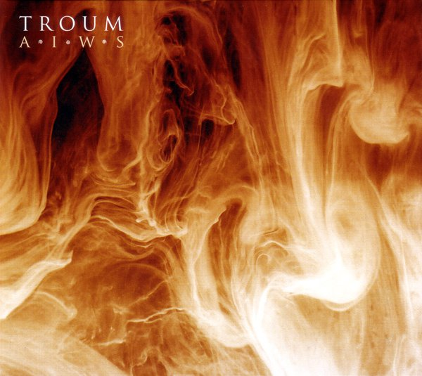

artist: **Troum** release: _AIWS_ format: CD year of release: 2007 label: [Transgredient](http://www.dronerecords.de/) duration: 49:26

detailed info: [discogs.com](http://www.discogs.com/Troum-AIWS/master/14322)

Glit\[s\]ch and Baraka\[h\] are back with their first full length CD album in several years. After a few collaborations and other things, they present us with _AIWS_. For those who aren't familiar with **Troum**: they can be considered one of Germany's foremost ambient/drone acts, and rose from the ashes of **Maeror Tri**, the project's predecessor. The duo took its time, recording this album between 2002 and 2005, but the result is well worth the wait.

The first remarkable thing is the artwork by **Alan McClelland**: smoke, fire, warmth. Abstract visuals the fit the music on this album perfectly. Then there is the album title. Presented on the front cover as A-I-W-S, and elsewhere as AIWS, it suggests more abstraction, or perhaps an acronym? However, _aiws_ also happens to be a Gothic (yes, I mean the language) word, meaning 'eternity'. It would surprise me a great deal if this were a coincidence - but whichever way, a more fitting title for such an album is hard to imagine.

The music then: these tracks are, in a way, surprisingly lo-fi for a drone act of today. Everything was recorded using instruments (guitars, e-bow, flute, accordion) on 4 and 8-track recorders. No digital manipulation whatsoever. Nevertheless, these guys are experts when it comes to creating deep and droning sounds, and I don't really miss the crystal clear production that I usually consider obligatory for this kind of music. Although **Troum** only uses instruments, all that remains in the final result are spaced out - and spiritual - waves and drones, divided into tracks that never become boring or stale. Even the occasional vocals (on "Aggilus" and "\[Ga\]plaian") are quite 'out there'. There is a lot of melody everywhere, ranging from threatening and dark to calm to melancholic, utilising a variety of different sounds. There are dynamics between main melodies and deeper bass support (especially in the first track and the excellent "Neheh"), which give the tracks a nice development, bringing them as close to proper 'songs' as is possible in a genre like this.

As a result, _AIWS_ is an accessible album that has a great deal to offer to many kinds of listeners. I can't do anything but urge anyone into experimental (analog) music to check this album out, as it's very detailed and atmospheric, not to mention profound. A real proof of skill from these two men - and highly recommended.

Reviewed by **O.S.**

Tracklist:

1\. Ahmateins (10:00) 2. Aggilus (1:51) 3. Spirare (5:53) 4. Per Sonum (6:02) 5. Pantah (4:27) 6. \[Ga\]plaian (9:38) 7. Penthos (2:45) 8. Neheh (5:44) 9. Peletä (5:04)
