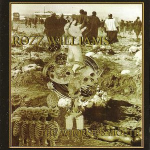

artist: **Rozz Williams** release: _The Whorse's Mouth_ format: CD year of release: 1996 label: Hollows Hill Sound Recordings duration: 60:24

detailed info: [discogs.com](http://www.discogs.com/Rozz-Williams-The-Whorses-Mouth/master/20018)

If there is one album that satisfies the criteria of dark and experimental, it has to be deathrock legend **Rozz Williams**' (1963-1998) _The Whorse's Mouth_. An album - and a project - that never got the attention it deserves, in my opinion. Usually, most attention goes to (goth/death)rock projects like **Christian Death** and **Shadow Project**. Maybe this is one of the reasons why this album appears to be forgotten: _The Whorse's Mouth_ contains all sorts of influences and sounds, but certainly no run-of-the-mill deathrock or gothrock. I can't think of a better definition for this album than the aforementioned dark and experimental; the album wavers between dirty industrial and noise-like tracks like "Raped" and "Best of the Breed" and breathtakingly beautiful, but also very melancholic tracks borne by piano, various classical instruments and sound effects like "A Fire of Uncommon Velocity" and "Dec. 30, 1334". It's certainly one of the more original albums in my collection; extremely varied, with well-composed songs.

Although the name of the project suggests otherwise, the tracks and lyrics on _The Whorse's Mouth_ are not written by Rozz Williams alone, but also by the various musicians who collaborated on the project: Erik Christides, Ryan Gaumer, Paris, en Erik Freeman. Additionally, Christian Omar Madrigal Izzo plays drums on "Best of the Breed" and "Who's in Charge Here", and Anne Marie plays the beautiful violin parts on "A Fire of Uncommon Velocity". All in all a quite intimate collaboration, and not a real solo project. On all tracks we hear Rozz reciting the lyrics with his characteristic soft voice. These lyrics are very original and remind me of a strange mix between modern poetry and apocalyptic visions. The lyrics are composed poetically, and meaning, rhythm, word association and all kinds of rhyme and metaphors blend into each other. This is best illustrated by a short example:

(from "Best of the Breed") _I would enjoy hanging you more than staying in this circle of love and danger a murderous plot played out in vague extremes Stick those pointed prongs strong Pierce any heart that might annoy you No sacramental goat protrudes in blind with draw all - kill it now or forgive the holy gown cow stun pun, doesn't it all run in vein?_

The artwork fits this kind of lyrics perfectly: estranging collages with many kinds of references, made by Williams and Christides. The music itself also forms a rich collage of sounds and atmospheres. The album starts with "Temptation", a track with a subtle mid-tempo rhythm en various sound effects, and in the foreground Rozz, of course, who recites a piece of The Lord's Prayer, among other things. I think "Raped" is the most conspicuous track on the album. Through the combination of a happy TV tune and a disturbing sample, it becomes a musical expression of one of Rozz's collages, which also often contain elements from popular culture combined with unsettling images and messages. The most beautiful track on the album, and one of the most beautiful I know in general, is "A Fire of Uncommon Velocity". It is the first track on _The Whorse's Mouth_ in this style: a hauntingly beautiful piano melody, accompanied by atmospheric violin and strong lyrics. Perfect for cold winter nights by candlelight. "HER Only sIN" is also remarkable. A relaxed rhythm and bass melody, recurring sound effects and piano accents that structurise the track, and lyrics that seem to relate the downfall that accompanies heroin addiction. "A Brother of Low Degree" has the same relaxed sound. "Dear Skin" starts off beautifully with piano and violin, changing halfway into calm, repeating effects. The lyrics themselves, by the way, are often rather crude and raw, and it could just happen that you're listening to a serene melody with Rozz going on about "condescending fuckholes" at the same time. The last fine, but very sad piano song is "Dec. 30, 1334", with some more great piano lines, this time accompanied by rather prominent bass. The lyrics are a goodbye to and sad recollection of life. The album closes with the heavy, noise-like "Best of the Breed", a track with a lot of distortion and a repeating high beep which again shows the diversity of this project.

The lyrics and dark atmosphere bind all tracks together and create a unique mood. I for one don't know any other albums like it by other artists. Closest is perhaps something like **Nico**, but mostly because that is also dark and unique music. _The Whorse's Mouth_ is a deep album on which many discoveries can be made - it certainly deserves to be more well known!

Reviewed by **D.M.K.**

Tracklist:

1\. Temptation (5:35) 2. Life is but a Dream (5:01) 3. Raped (4:38) 4. Who's in Charge Here? (Beneath the Triumph of Shadows) (3:56) 5. A Fire of Uncommon Velocity (5:47) 6. HER Only sIN (4:58) 7. Interlude (2:02) 8. A Brother of Low Degree (6:06) 9. Dear Skin (4:58) 10. Maggot Drain (3:56) 11. Dec. 30, 1334 (8:58) 12. Best of the Breed (4:29)
