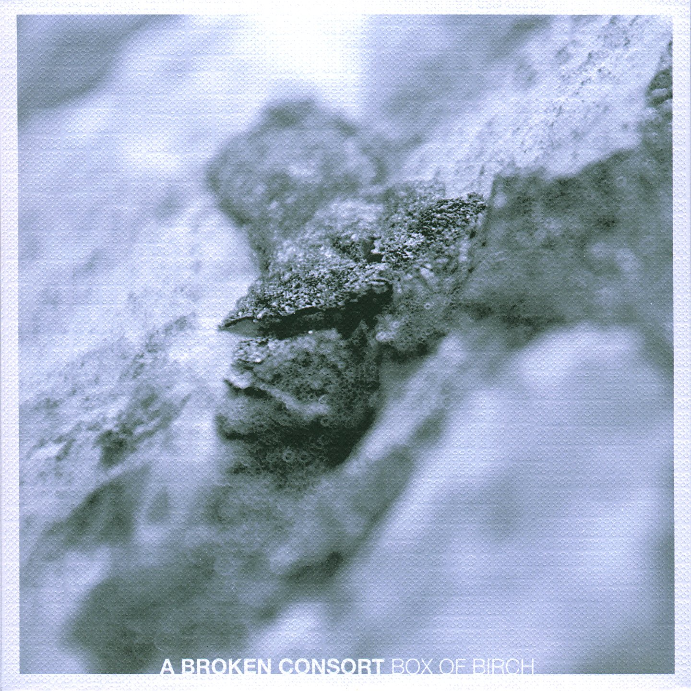
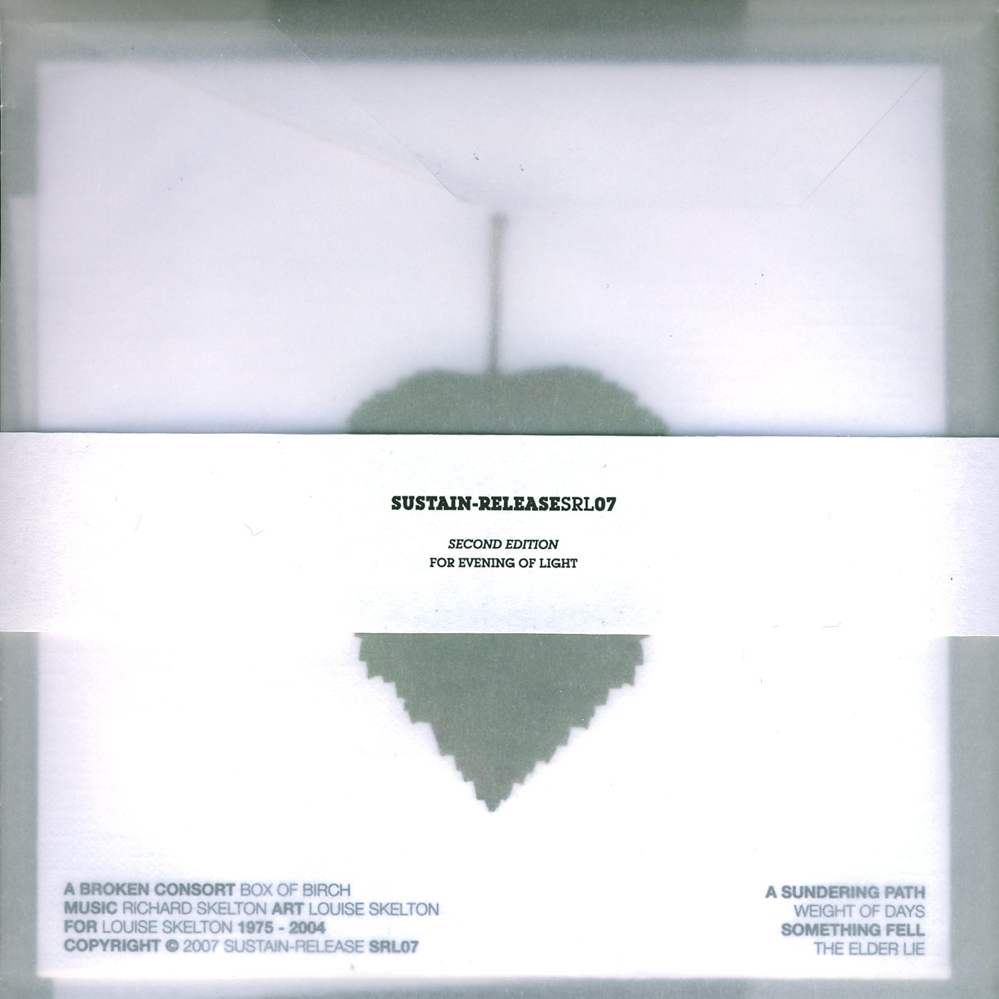

artist: A Broken Consort  
release: Box of Birch  
format: 2x3" CD-R, CD-R  
year of release: 2007  
label: [Sustain-Release](http://www.sustain-release.co.uk/)  
duration: 37:19

detailed info: [discogs.com](http://www.discogs.com/A-Broken-Consort-Box-Of-Birch/master/64973)

**A Broken Consort** is one of the projects by Englishman **Richard Skelton** on his own **Sustain-Release** label. The first album, _The Shape Leaves_, was released in 2006 and introduced us to the rich organic freefolk sounds of the project. _Box of Birch_ elaborates further on this style with four new tracks.

One of the greatest things about Sustain-Release albums is the personal attention paid to the layout and presentation. The extremely limited first edition of this album was presented as a double (silver and black) 3" CD-R in a box. This second edition is a single regular CD-R, in a printed carton sleeve, wrapped in translucent paper along with a little info sheet and a birch leaf to complete the theme. Altogether quite wonderful!

The music consists of long-spun acoustic soundscapes - drones and melodic repetitions, but with a great depth of sound. Most prominent are guitars, percussion, and various other bowed and strummed strings. The result is at the same time familiar, rooted in the earth, but also far from everyday experience. A wonderful musical depiction of the mystic depths contained in natural landscapes with only a hint of cultivation.

The first two tracks explore the basic instrumentarium mentioned above, but "Something Fell" introduces delicate touches of piano. The final, shortest track is more prominently ruled by a beautiful, sad string melody. There is a profound mourning in "The Elder Lie", and it's hard not to be touched by it.

_Box of Birch_ is an excellent album, not in the way of variation, but in pure wealth of sound. These are warm acoustic soundscapes that take you briefly into Richard's musical realm, a place I'm always reluctant to leave. More please!

Reviewed by **O.S.**

Tracklist:

1\. A Sundering Path (10:10)  
2\. Weight of Days (8:44)  
3\. Something Fell (11:30)  
4\. The Elder Lie (6:55)
