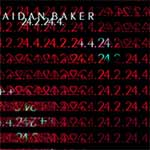

artist: Aidan Baker release: 24.2.24.4. format: MP3 year of release: 2005 label: [Dark Winter](http://www.darkwinter.com/) duration: 47:55

detailed info: [discogs.com](http://www.discogs.com/Aidan-Baker-242244/release/569004)

**Aidan Baker** has made quite a name for himself in the experimental music scene, with a great many releases over the past years. This Dark Winter netrelease is just one of them, but it's a fine example of his craft. In this case that means one track spanning 48 minutes of spacy ambient drones based only on guitar and bass.

The concept behind this track is very appealing, and the explanation on the label page is as follows: "Four 24 minute tracks made up of four 24 second samples of two instruments." Using and re-using bits of recording, Baker has welded together a massive track that is coherent, yet diverse enough to remain interesting. Throughout the entire track, we basically hear much of the same melodies and sounds (only four different samples were used, after all), and that keeps the structure of the track together. At the same time, manipulations and effects, as well as different configurations of the samples create a variety in the way the sounds are used. A very mathematical and refreshing approach to creating music, to be sure. At the same time, this approach is one of the weak points of the track, because although there is some variation, the whole track sounds quite the same throughout, and is more suitable for relaxed or background listening than an attentive mode, I believe.

All the same, this is a very nice release, and [totally free](http://www.darkwinter.com/dw018.html), of course. So, if you were impressed by Baker's other works, or dig **Troum**'s music, for example, this is a good one to download.

Reviewed by **O.S.**

Tracklist:

1\. 24.2.24.4. (47:55)
