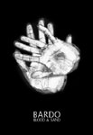

artist: Blood & Sand release: Bardo format: CD-R year of release: 2007 label: Bunkier Productions duration: 46:49

detailed info: [discogs.com](http://www.discogs.com/Blood-Sand-Bardo/release/1343444)

When it comes to capturing and delivering feelings, I think the Russians do a good job. And they have proven several times that when it comes to playing dark folk music they also know what they are doing. Of all the bands I can think of, I can’t remember one that has disappointed me. And now it’s **Blood & Sand**’s time to show the world what they go for. Even before the disc is placed in the CD-player, you are full of impressions. The cover art is great, and the packaging as well. It’s like a book with the lyrics and more artwork in the vein of the cover picture printed in silver on a black background. The lyrics are the only information we get, no names of the musicians and no records info what so ever.

Even though most of the song titles are in English, the lyrics are all in Russian. I think that is a good thing; I always prefer when bands sing with their native tongue, even if it means that I don’t get the lyrics. With English titles it gives at least a hint what the songs are about. Even better would be to include English translations of the lyrics. Anyway, the album opens with the only track that actually doesn’t have an English title, the title track "Bardo". Immediately you can tell this is a fresh wind. Its strumming guitar, classical violin arrangements and soft keyboard plings brings the land comrades **Romowe Rikoito** to mind but it’s not quite as tragic. That we owe to the vocalist whose voice balances between devastated and cheerful. A flute and some simple drums can also be heard, barely. The following track "You Search" is slower with a more romantic feeling and it makes me think of **Ashram**’s guitar driven songs. Even slower is the one after that, an instrumental piece called "Uprise". Once again the **Romowe Rikoito** influences are obvious.

**Blood & Sand** continues to deliver classy dark folk and the further into the album we get, the more powerful the songs are. Beside the bands I’ve mentioned you’ll hear influences from German acts like **Sonne Hagal** and **Forseti** here and there but the band’s personal style stays intact. The instrumentation remains, relying on guitars and violins, but the sixth track also includes an accordion. This track stands out in other ways as well... In some earlier songs there was a woman choiring. Here she sings a duet with the main vocalist. It’s quite nice.

On "Collapse" the album takes a short turn towards the neoclassical way. Strings, drums, a layer of atmospheric keyboards and some strange samples that sound like a children laughing. Combine that with some Russian angst and there we have a really touching piece of ambience that leads us straight into one of my personal favourites on this album. It sounds like "Ideal" has drawn more inspiration from the German scene than the previous tracks. The violins are more folky than classical and the drums more prominent in this song. What follows is an instrumental outro with a slow piano melody that moves over into a delicate guitar, all backed up by the cries of a lonely violin. There is also a bonus track, a different version of the second track, this time with birds and ocean waves samples, and female vocals.

I can understand that when you read this review, you might think, "Aha, another neofolk release. I’ve heard this a million times before", but I must say that **Blood & Sand** is something special, they already stand out with their own strong sound in the dark folk world. What makes this a winner are the beautiful melodies and the professional played strings. There are, of course, things that could have been improved but this is nonetheless one of the most promising debuts of the year. To bad it seems that **Blood & Sand** will never get the chance to improve since rumours are saying that they already have disbanded. If so, I sense that _Bardo_ will become a future cult gem.

Reviewed by **CME**

Tracklist:

1\. Bardo (3:48) 2. You Search (4:35) 3. Uprise (2:29) 4. Blood & Sand (4:50) 5. Fire Dancing (3:48) 6. For Faith (4.09) 7. 25 (4:24) 8. Collapse (3:22) 9. Ideal (5:28) 10. Sunset (4:54) 11. You Search (bonus track) (5:08)
