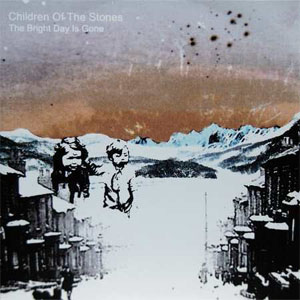

artist: Children of the Stones release: The Bright Day is Gone format: CD-R year of release: 2006 label: [Deserted Village](http://www.desertedvillage.com/) duration: 39:55

detailed info: [discogs.com](http://www.discogs.com/Children-Of-The-Stones-The-Bright-Day-Is-Gone/release/1171753)

If there ever was a hotbed of creativity, it's definitely the people around **United Bible Studies** in Ireland. Besides numerous release from the collective itself, we've also seen a lot of great stuff by David Colohan's **Agitated Radio Pilot**, to name just one of many related projects. **Children of the Stones** is another such project, which is in a way like the others, but also has an approach of its own. The music and name of the project, by the way, are a direct reference to the 1970's British magical realist children's series of the same name (see [Wikipedia](http://en.wikipedia.org/wiki/Children_of_the_Stones)). Instrumentals are mixed with piano songs, but also cold ambient passages, and that makes for a unique album.

I'm not sure exactly which members are involved in this project, but I presume **United Bible Studies**' **Gavin Prior** is among them, and **David Colohan** surely is, because he lends his vocals to this album. Opener "Here Lives the Moon" is a relatively warm track, perhaps most like **United Bible Studies** than any other track, and the beginning is deceptive. If you're expecting more of the same freefolk warmth, you're mistaken. "The Pale Stars Alone (Over a Quiet Earth)" introduces David's vocals over piano and harpsichord in a melancholic song, sparse and cold in its atmosphere. "Sparks of Frost" is instrumental, but continues a bit of the glittering nighttime atmosphere. "Day is Done" is indeed a **Nick Drake** cover, but instead of warm guitar, we get chilly synths and faint electronic beats in a very moody version indeed. "Where Amongst the Ruins" and "Poor Scott" are two final piano songs with great lyrics and sad atmosphere, even vaguely reminding me of **Current 93**'s _Soft Black Stars_. Then we're halfway, lengthwise, and we enter into yet another new musical territory. "Fog on the Womb Road" is a sublime, ice-cold ambient track, based solely on synth choirs. This one sends shivers down my spine. "The Interior Left Empty" takes us deeper into darkness, with twelve minutes of minimalist ambience, based on thin waves, high-pitched synth wails, and spooky sound effects. Only at the very end of the album does the darkness retreat before the warmer tones of the rising sun, in the solace of a guitar-based instrumental.

What can I say? The output of these Irishmen is not only impressive in terms of quantity, but the quality is certainly there as well. This album could be a bit better in terms of performance and sound here and there, but it is original and exciting through and through. 2006 turned out to be not only the year of two excellent **Agitated Radio Pilot** and **United Bible Studies** albums, but also of this little gem. Recommended to any fan of Deserted Village material, as well as those interested in original mixtures of song, acoustics and ambient.

Reviewed by **O.S.**

Tracklist:

1\. Here Lives the Moon (4:21) 2. The Pale Stars Alone (Over a Quiet Earth) (2:03) 3. Sparks of Frost (2:21) 4. Day is Done (2:58) 5. Where Amongst the Ruins (2:04) 6. Poor Scott (4:04) 7. Fog on the Womb Road (7:10) 8. The Interior Left Empty (12:30) 9. Here Lives the Sun (2:24)
