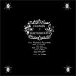

artist: Cloama & Blutleuchte release: From Wasteland Mausoleums format: CD year of release: 2007 label: [New Old Sentinel](http://www.neuroscan.org/nos) duration: 59:29

detailed info: [discogs.com](http://www.discogs.com/Cloama--Die-Blutleuchte-From-Wasteland-Mausoleums/release/1005220)

_From Wasteland Mausoleums_ is the second collaboration between the Finnish **Cloama** and also Finnish **Blutleuchte**. Sadly enough, I haven't heard the first collaboration, but this album has certainly made me curious!

On _From Wasteland Mausoleums_ we hear a very good blend of different styles, being mostly dark ambient, drone, noise, industrial and sound experimentation. A lot of effects and instruments (predominantly electric guitar) are used, which makes for a very rich sound. At times, lines of lyrics are spoken. The atmosphere is very dark and oppressive, sometimes aggressive, sometimes cold and empty. I'll present some examples to give you an idea of the different sounds.

The album starts with "Blackbird's Den", one of my personal favourites: a pitch black ambient track with a great atmosphere. We hear a vague, echoing voice reciting a dark poem, the lyrics accentuated by drums and soft waves in the background. "The Tower Covered in Frozen Ectoplasma" forms a calm bridge to the rest of the album, a very good track with repeating tones in the background and different effects and sounds. A pretty experimental track is "Bow of Insanity"; we hear distorted voices, flute(?), rhythmic accents, and a heavy drone that pierces the silences. "The Voice and the Serf" is a heavy and chaotic noise track, with repetitive static, manipulated screams, distorted guitars and other effects. This is followed by the equally noisy and heavy "Archean Quartzite Hammer", which I like even better because of the fast rhythmic noise. "Sepulchral Starlight" is also an interesting and varied track, starting with repetitive noise, and changing into a kind of piano melody with effects and distortion, and over that again that vague voice. In an interlude, we hear the noise from the beginning again, with added guitars, and again this is interchanged with the piano. "Lord of the Equinoctial Fountain" wouldn't be out of place on a (drone) doom record; we hear a thick layer of slow distorted guitars, overlayed in the later parts of the song with electric guitar leads. The same goes for the next track, "Archaic Waters Enshrine the Seer".

The other tracks also fit the atmosphere, and together they result in an interesting album in a style of which I'd like to hear more. The artwork is also quite good, especially the great picture of a swooping owl on the back... Lovers of aforementioned styles and for example projects like **Halo Manash** should definately add this record to their collection.

Reviewed by **D.M.K.**

Tracklist:

1\. Blackbird's Den (5:35) 2. The Tower Covered in Frozen Ectoplasma (5:39) 3. Spirit Risen Amidst the Shadeless Desert (2:53) 4. Bow of Insanity (4:32) 5. The Voice and the Serf (6:05) 6. Archean Quartzite Hammer (6:02) 7. Sin Gate (1:54) 8. Passage over Possessed Grove (3:58) 9. Sepulchral Starlight (4:43) 10. Lord of the Equinoctial Fountain (6:15) 11. Archaic Waters Enshrine the Seer (5:31) 12. Morbid Sentinel (6:22)
