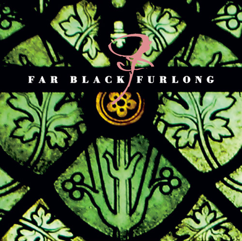

artist: **Far Black Furlong** release: _The East Room_ format: MP3 year of release: 2006 label: Woven Wheat Whispers duration: 24:38

detailed info: [discogs.com](http://www.discogs.com/Far-Black-Furlong-The-East-Room/release/1530585)

_\[Note: The remark about the **M.R. James** story in the second paragraph turned out to be incorrect. There is actually no such story, and it was apparently made up by Mark Coyle of the label in a flight of fancy.\]_

**Far Black Furlong** is an English experimental (folk) music project, with a varying cast of musicians. The core members are pianist and composer **Richard Moult**, oboeist **Mark Baigent**, electronic artist **Andy Cotterill** and guitarist **Ian Tengwall**. Guest artist on this release, I assume on hurdy-gurdy, is **Anne Marie Summers** of **Misericordia**, among other mediaeval ensembles.

_The East Room_, inspired by an apparently unfinished story by famous English scholar and writer **M.R. James**, is the third release by the band, after two previous EPs. Like the earlier releases, this one proves that Far Black Furlong is a very interesting newcomer in the musical underground, operating between folk, ambient, classical and mediaeval music. More concrete than the long soundscapes of the previous EP _Haidd_, _The East Room_ takes us to the mysterious chamber from the story in four movements.

During these four instrumental songs, different instruments combine to create a rich musical depiction of the mysterious atmosphere that pervades the theme of the album. Subtle touches of piano occur everywhere, and often we hear support of recorder, hurdy-gurdy, pipes, harp, and the exquisite sound of the oboe. These are trained musicians at work on untrodden ground - one of the most innovative bands I've heard in quite some time. Elements from mediaeval and classical music and folk are blended in perfectly with experimentation and improvisation to create something unique. The music on this album is sometimes calm (movement II and IIII) sometimes threatening and intense (the mad guitar and pipes duet on III), but always mystic and atmospheric.

It's not an easy job to describe exactly what's going on in these 25 minutes, but I think it's magical. If, by any chance, you have the _John Barleycorn Reborn_ compilation, be sure to play "The East Room V" after listening to this, because it's a brilliant epilogue to finish off an already quite strong EP. This is one of the most impressive release I've heard lately, and I recommend everyone to go and check this out - I don't think you'll regret it! It's only available as an MP3 download from Woven Wheat Whispers, but it comes with a high-quality booklet for home printing. Keep the name Far Black Furlong in the back of your head, I'm sure a lot more beautiful music will come from this direction!

Reviewed by **O.S.**

Tracklist:

1\. The East Room I (7:03) 2. The East Room II (5:47) 3. The East Room III (5:15) 4. The East Room IIII (6:33)
