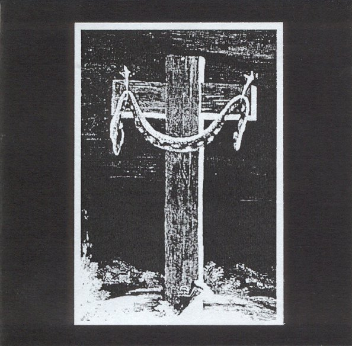

artist: **Gelsomina** & **Nyrjä** release: _Coronation of the Serpent_ format: CD-R year of release: 2007 label: [Musically Incorrect](http://mir.blogdns.com/) duration: 63:14

detailed info: [discogs.com](http://www.discogs.com/Gelsomina--Nyrj%C3%A4-Coronation-Of-The-Serpent/release/1018247)

_Coronation of the Serpent_ is a heavy noise/ambient collaboration from the Finnish underground, released on the **Musically Incorrect** label, which was recently stopped. I hadn't heard any material before by either **Gelsomina** or **Nyrjä**, but this album is a nice, though rather long, collection of dark noisy tracks.

It starts off with "Glowing Cracks", which is based mostly on deep drones and waves with a prominent layer of distortion. It's a very long track that offers little in the way of variation to casual listeners. Only if you take the time to drift away on the drones do you sense that there is a strong development. The same applies to the second track. Subtle sounds effects are woven into the music, but they are very hard to notice beneath the heavy layers of noise. Distorted spoken word decorates the later part of the track. The other tracks are built up in pretty much the same way, and there isn't any clear highlight on the album, as all tracks sound quite alike, though with subtle differences in the exact character and composition of the noise and waves.

The sound is both a blessing and curse for this album, in my opinion. The noise-drenched texture suppresses a bit of the auditory detail that would be more clear otherwise. This makes this album less interesting for people who mostly like rich detailed ambient with a clear production. On the other hand, it makes the tracks sound really angry and oppressive, and if that were the emotions to be expressed, these artists have succeeded. This is excellent music for playing at full blast while walking through crowded places in a misanthropic mood.

In short, this not so much an album for the average dark ambient lover, but noise enthusiasts are encouraged to give this one a try. Although it's a rather long album for this kind of sound, the atmosphere and production are spot on for angry and heavy music like this.

Reviewed by **O.S.**

Tracklist:

1\. Glowing Cracks (15:49) 2. Anticosmos (16:43) 3. Nigr (8:29) 4. Prayers on Fire (13:51) 5. The Streaming Serpent (8:22)
