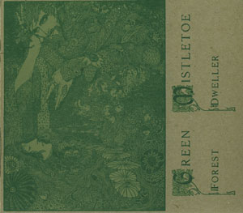

artist: **Green Mistletoe** release: _Forest Dweller_ format: CD year of release: 2007 label: [Little Somebody](http://www.myspace.com/littlesomebody) duration: 30:07

detailed info: [discogs.com](http://www.discogs.com/Green-Mistletoe-Forest-Dweller/release/1247200)

**Green Mistletoe** is the musical project of American **Brian Waters**, and he plays a very relaxed kind of forest folk, with a peculiar mixture of Christian and Heathen thematics. He has several releases, but this is one of his latest, on **Little Somebody** records. Once again, Little Somebody's Pythagumus comes with an exceptional design, this time with a gorgeous green printed line drawing on a card stock foldout digipack, as well as nice CD and lyrics inserts.

Brian's music is based mostly on acoustic guitar, percussion, and occasional other instruments like lap harp or zither. He also uses a wide range of vocal styles, some with more succes than others. For example, I don't really care for the distorted low 'monster' vocals on tracks like "13 Firewoods", which is otherwise a great concept track: a translation of a Gaelic folksong educating the listener about the character of different kinds of firewood. On the other hand, he sounds quite excellent on "Stone Ring in Open Glade", which is also one of my favourite tracks on the album.

I also really dig the lyrical character of the tracks. More than many other artists, Brian really gets into areas of folklore, nature mysticism and religion, and the like. And as mentioned, there is a seamless mix between 'pagan' and Christian themes, as is perhaps best expressed by the lyrics on "Evocation to Green Elohim":

_Beyond this wall of stones lies a hidden path_ _deep within the forest where I create a holy door,_ _my threshold between worlds where I pray_ _to my green Elohim._

Musically the album never really gets _truly_ exciting though. Most of it is relaxing and pleasant, but nowhere exceptional. Perhaps we can put this down to inexperience? In any case, a little more fireworks wouldn't have hurt _Forest Dweller_. All in all, this is a nice album though, especially in terms of concept, lyrics, look, and atmosphere. If you're into mystical foresty (neo)folk, this album is worth seeking out.

Reviewed by **O.S.**

Tracklist:

1\. Skybear (1:45) 2. Cymru (1:52) 3. Stone Ring in Open Glade (2:28) 4. Woodland Trail to the Lake (3:13) 5. Y Golwg (the sight) (1:33) 6. 13 Firewoods (1:36) 7. Crosswise Cut the Apple in Two (1:35) 8. Igwja Dher (yggdrasil) (3:33) 9. Evocation to Green Elohim (3:45) 10. Kateri, Lily of the Iriquois (2:25) 11. Mynd Am Dro Yn Coeden (to go for a walk in the woods) (1:45) 12. Forest Dweller (4:37)
