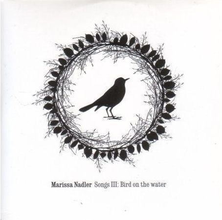

artist: **Marissa Nadler** release: _Songs III: Bird on the Water_ format: CD year of release: 2007 label: [Peacefrog](http://www.peacefrog.com/) duration: 48:06

detailed info: [discogs.com](http://www.discogs.com/Marissa-Nadler-Songs-III-Bird-On-The-Water/master/67615)

_Songs III: Bird on the Water_ is, you might have guessed, Nadler's third album, only a couple of years after her excellent debut. Now, I was very enthusiastic about this albums predecessor, _The Saga of Mayflower May_, so expectations were high. But, as it turns out, a natural singing and songwriting talent like Marissa does not disappoint. _Songs III_ has perhaps lost a bit of the gloom and ghostliness that permeated the previous two albums, it has gained maturity in an almost equal degree. This is another great collection of folky songs with a melancholic and quirky touch.

The single "Diamond Heart" begins the album in a familiar way. Pleasant acoustic fingerpicking, Marissa's unique soprano, fine mandolin by **Jesse Sparhawk** and a set of great lyrics about travel, loss, and longing. "Dying Breed" takes it to the next level with a great guitar melody and catchy vocal line - not to mention more great mysterious lyrics, this time with a heavy use of colour, as on earlier tracks like "Yellow Lights". "Mexican Summer" is a perhaps slightly conventional 'summery' song with laid-back acoustic chords and warm electric tremolo leads, but it works perfectly on this album. You see, there I go: I don't want to write about every single song, but only about the highlights, and yet I end up writing about the first three tracks in a row, with the fourth easily added to it! Naturally, because "Thinking of You" is one of strongest tracks on the album. Another great melody, and soft cello support by **Helena Espvall**. I'll stop here, and just assure you that all tracks on this album are simply very strong.

A new element on this album is also the addition of some psychy electric guitar soloing, courtesy of none other than **Greg Weeks** (of **Espers** and solo fame). This is not an unequivocal success, in my opinion. On the one hand, it takes tracks like "Bird on Your Grave" and the excellent and dark "Rachel" into a new original territory, and makes the album as a whole even more accessible and varied. On the other hand, it mars the purity of the songs in a way, compared to what we've become used to on the excellent previous albums - it's not the same misty, cold sound. However, compared to the obvious quality of everything presented on this album, this is but a minor issue; a love-it-or-hate-it affair.

Special mention also goes to "Famous Blue Raincoat", a flawless and heartfelt cover of **Leonard Cohen**. Finally, I'd like to mention the beautiful "My Love and I", another one of my favourites. Soaring vocals and soft organ drift over a layer of reverbed acoustic guitar, which in this case does remind me of Marissa's earlier albums.

After three excellent albums, and with a frequent live presence across the world, I believe it's safe to say **Marissa Nadler** is one of the most important names in the field of alternative folk and singer/songwriter music. Personally, this album touches me just a tad less than the earlier ones, but whether you're already a fan, or are new to Marissa's music, _Songs III_ is a very strong album that is well worth seeking out.

Reviewed by **O.S.**

Tracklist:

1\. Diamond Heart (3:47) 2. Dying Breed (3:38) 3. Mexican Summer (5:27) 4. Thinking of You (3:36) 5. Silvia (5:40) 6. Bird on Your Grave (5:02) 7. Rachel (4:20) 8. Feathers (3:59) 9. Famous Blue Raincoat (4:23) 10. My Love and I (3:32) 11. Leather Made Shoes (4:42)
