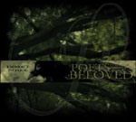

artist: **Poets to their Beloved** release: _Embrace the Fool_ format: CD year of release: 2007 label: [Equilibrium Music](http://www.equilibriummusic.com/) duration: 56:45

_Embrace the Fool_ is one of the first albums to come from **Equilibrium** Music this autumn, and to be honest **Poets To Their Beloved** couldn’t have found a better label to release their first album. I also doubt that Equilibrium Music could have found a better fitting band to add to their line-up. This is _SO_ Equilibrium in every positive way I can think of.

As I mentioned this is the bands first album, but that doesn’t mean that the musicians are making their debut. Marcel Schiborr who handles the guitars, some percussion and the male vocals has a past in the melodic death metal world. That he’s been playing advanced music before this project is pretty obvious and you should hear that already in the first track. By his side is Saskia Dommisse and I’m glad to see a woman who does more than just sing. Saskia plays dulcimer, as well as keyboards and drums. AND she sings with a great vocal span. If this isn’t enough for you many tracks have stunning violins and cellos (played by a guest called Van Herpen) in the background.

Those who are into other Equilibrium artists like **Dwelling** and **The Moon And The Night Spirit** know what to expect. It’s (mostly) acoustic folk music with a strong ethereal, melancholic and romantic feeling. At times it sounds almost a bit pastoral, progressive and ritual. The latest due to the tribal percussion, that helps lifting the awesome music to yet another level. Up-tempo, pulse raising songs and slower ones are mixed and forged together with a great folklore atmosphere. As I mentioned earlier Equilibrium Music is the perfect label for _Embrace the Fool_, but I wouldn’t have been surprised if this album were released on Prikosnovénie.

**Poets To Their Beloved** hasn’t missed a thing. The music is flawless, the cover art is great and so is the booklet, which includes all the personal, deep and mystic lyrics as well as photos of the two musicians. The tracks are perfect in length; not too short and not long enough to be strenuous. The male / female vocals are perfectly balanced throughout the album. But there has to be some flaws, you think. Something has to prevent _Embrace The Fool_ from being a nine pointer or even an Eclipse? Yes. But I can’t say what, exactly. Maybe some more variation would have been possible? It’s not at all dull! But with all this instruments and talent there would have been room for more experiments, I think. Note; I THINK.

Reviewing an album of this kind and not to mention the legendary band **Dead Can Dance** wouldn’t be fair. This band would not have existed if it weren’t for them. It’s not just probably one of their biggest sources of musical influence... this German / Dutch duo even met each other via a **Brendan Perry**workshop in Ireland. I can’t say anything else than thank you **Dead Can Dance**, for this great offspring. And thank you Saskia and Marcel for all these great tunes. Thanks to Equilibrium Music also, for releasing such a great album. It works as, at least my, soundtrack for the autumn 2007.

Reviewed by **CME**

Tracklist:

01\. Embrace the Fool (6:28) 02. Love (4:01) 03. Ecstatic Dance (3:57) 04. My Moments of Tranquillity (4:31) 05. The Disillusioned Nihilist (3:15) 06. Ode on Melancholy (4:23) 07. The Golden Cage of Fateful Emotions (4:10) 08. Traveller of Stars (2:56) 09. Your Eyes So Strange to Me (5:16) 10. Innate (5:24) 11. I Drowned in You (3:50) 12. In Your Dreams (4:51) 13. Soul Friend (3:43)
