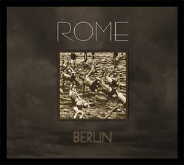

artist: **Rome** release: _Berlin_ format: CD year of release: 2006 label: [Cold Meat Industry](http://www.coldmeat.se/) duration: 17:44

_Berlin_ is the debut EP of the by now already pretty well known **Rome**, the neofolk/martial project of Luxemburgian Jérôme Reuter. A pleasant surprise within the scene, because many artists who make good and innovative music already have a long track record, which has made some listeners wonder if there is still room for innovation in the genre. **Rome** gives a positive answer to this question with this highly promising debut.

_Berlin_ contains six tracks of calm, but also sad and reflective music, blended with martial-like influences. This short release starts with "Like Lovers", an ominous track with the calm, pleasant voice of Reuter, militaristic percussion, effects and samples (among others of 'Hitler' from the film _Rise of Evil_). The next song is my personal favourite, along with the final track, to which I shall return. On "The Orchards" we hear a relaxed, catchy guitar melody and percussion, supplemented by vocals and samples. The same laid back atmosphere returns in "Une Autre Vision", this time without guitar, but with piano, and again the characteristic vocals and samples. It's songs like this that make **Rome** such a unique and innovative project. The tracks are built up to really be 'songs', with a start and a finish, not soundscapes or abstract atmospheres, which one hears so often in martial or electronic projects. Neither does it have that much of a 'tough soldier boy' factor as a lot of martial. But, it's also not really comparable to guitar-based neofolk as we know it from bands like **Forseti** and **Sonne Hagal**. I can best describe this sound as a subtle and relaxed mix of both genres, with a great execution and production, by the way. But, back to the songs. "Clocks" and "Wake" are very short tracks, both with a constant background and rhythmically used effects. The spoken word and samples aren't absent either. The EP finishes with the exceptionally beautiful "Herbstzeitlose", a modest piano song with very strong lyrics. The lyrics are all very good, by the way; poetic and ambiguous, and often with a sombre touch (as testified by lines like:Once we learned to speak we learned to fail / We turned white and cold / Like lovers).

As you will have understood, I'm quite enthusiastic about this debut, and this is certainly a band I will follow. If you like neofolk, martial and related genres, and are looking for a new sound, you'd do good to acquire something by **Rome**, a band certainly deserving of all the attention and praise it's been getting lately.

Reviewed by **D.M.K.**

Tracklist:

1\. Like Lovers (2:38) 2. The Orchards (3:07) 3. Un Autre Vision (3:16) 4. Clocks (2:29) 5. Wake (2:38) 6. Herbstzeitlose (3:36)
