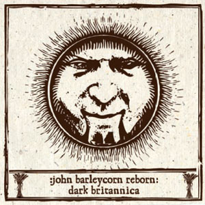

artist: **Various Artists** release: _John Barleycorn Reborn : Dark Britannica_ format: 2CD + MP3 year of release: 2007 label: [Cold Spring](http://www.coldspring.co.uk) & Woven Wheat Whispers duration: 5:08:16

detailed info: [discogs.com](http://www.discogs.com/Various-John-Barleycorn-Reborn/release/1070437)

Where to begin with an absolutely massive compilation like this? Well, it all started with Mark Coyle's Woven Wheat Whispers label, which started in late 2005. Since then, he has managed to gather an impressive number of artists to his MP3-only label, covering the broad area of underground modern folk music, ranging from traditional to folk rock, from neofolk to psychedelic folk, from mediaeval to pagan folk. Hundreds of albums have been (re-)released, and the scope of the label has become huge. All the more reason why an overview compilation like this one is very welcome. Not only does the first edition of the _John Barleycorn Reborn_ series contain a host of great artists, this is only the tip of the iceberg, for as the subtitle gives away, only English artists have been featured on this album (with the unforeseen exception of **novemthree**). More editions are to come, which will contain American artists, other European countries, and who knows what else?

But, let's focus on this one first. In collaboration with English neofolk/post-industrial label Cold Spring, Woven Wheat Whispers has released the main part of the compilation on a fine 2CD set, contain well over two and a half hours of music. But, a WWW release wouldn't be complete without some free stuff. In this case, this means a huge MP3 supplement, freely downloadable if you've bought the CDs. It contains a further two and a half hours of music, making the total running time of the set over five hours - now there's value for money.

But, the value is not only in quantity, but also in quality, as there are so many great artists from various subareas of the folk world featured on this compilation. Even more so here than anywhere else, it would be a fool's errand to try and give an in-depth review of every track. As it as, I'll try and pick out the highlights, while giving a taste of the diversity contained in here at the same time. Of course, this compilation wouldn't be complete without renditions of the traditional song that gave it its name: "John Barleycorn". Both CDs start with a version of this classic, and **The Horses of the Gods** and **The Anvil** both pull it off convincingly and originally. Other traditionals also feature on the album, such as "Lay the Bent to the Bonny Broom" by **Charlotte Greig** and **Johan Asherton**, who deliver a long, intimate rendition of this cruel ballad. **Clive Powell**'s "Reed Sodger" is based on various pieces of traditional rhyme, and features Clive's unique voice over subtle electronics. The omnipresent (but rarely dull) "Twa Corbies" is here executed by pyschedelic folkrockers **Mary Jane**, who turn this track into a quite funky affair. "Pew Pew" is a Scottish traditional text, here set to harp and recorder by **Quickthorn**, featuring the vocals of **Prydwyn**. But, one of my absolute favourites has to be **Venereum Arvum**'s version of "Child 102", the ballad of the birth of Robin Hood. Sean and Rachel's vocals soar in unison above subtle accompaniment, letting the beauty of the melody speak for itself convincingly.

Also the non-traditional tracks contain some great stuff. The English division of neofolk can't be left out here, of course, and least of all **Tony Wakeford**'s **Sol Invictus**, who come with a brand new track, representative of the band's recent experimental direction. This is equally true of **The Triple Tree**, where Tony collaborates with **Andrew King**. "Three Crowns" is a dark track combining acoustic soundscapes with obscure folkloric themes (in this case from an **M.R. James** story). **Andrew King** solo is a guarantee for traditional song delivered with conviction, and based on proper research, and his version of "Dives and Lazarus" is no exception. This is a re-recorded version of the track which originally appeared on the split with **Changes**. **Matt Howden**'s **Sieben** is also featured with a remix of a track from _Ogham Inside the Night_; a fine example of his original violin 'n' vocals approach to folky modern song. Finally, there's **While Angels Watch**, with a not totally convincing track, which nevertheless has a very nice atmosphere and development.

But there's so much more going on here I just have to mention. **Damh the Bard** delivers a rousing piece of pagan folk on "Spirit of Albion". **The Kitchen Cynics**' "The Guidman's Ground" is a song based on spacy guitar, accompanied by subtle vocals telling a rather dark folk narrative. "Summerhouse" by **The A. Lords** is a wonderfully serene piece of pastoral music, based on guitar, organ, and field recordings. The ever impressive **Sharron Kraus** comes with the very nice little "Horn Dance". More esoteric things are happening with **Alphane Moon**, who offer a brilliant mix of semi-gregorian singing and the mystic acoustic sounds we've come to expect from these people at Oggum Records. Even more occult is **English Heretic**, of course, as always exploring obscure folkloric subjects, and presenting the results in the form of experimental music, here with electric guitar freakiness, wild vocals, drums, and samples. "Stained Glass Morning" by **Sand Snowman** is a great piece of psychedelic folk, combining superb acoustic guitar melodies with soothing female vocals.

And that was just the first 2CD part of the collection! If you get this album, be sure to get the free MP3 download as well, because there are quite some hidden gems in there as well. Of course, no time to mention them all, but here's the ones that stuck with me most. First of all, **Far Black Furlong** present a wonderful epilogue (again with great oboe work) to the already excellent _[The East Room](http://www.eveningoflight.nl/2007/10/01/review-far-black-furlong-the-east-room-2006/ "Review: Far Black Furlong – The East Room (2006)")_ album, also on Woven Wheat Whispers. Odd one out is American **novemthree**, who nevertheless brings two convincing instrumental track of his foresty folk with nice percussion. **Alan Trench** and **Martyn Bates**' **Twelve Thousand Days** presents "Thistles", a wonderful track from their 2006 album _From the Walled Garden_. Other work of Trench's is also featured, with nice tracks by **Orchis** and **Cunnan**. **Paul Newman**'s "Lavondyss" is a very good melancholic track on vocals and acoustic guitar. We also get a very nice selection of tunes from some of England's finest mediaeval artists, such as **The Daughters of Elvin** and **Steve Tyler**. Best of all is **Misericordia**'s "De Poni Amor A Me", a superb song based on hammered dulcimer, hurdy-gurdy, and bagpipes.

I haven't mentioned all, of course, and this is not the place for an even more in-depth approach. It doesn't mean the unmentioned tracks aren't good or interesting, of course, because this compilation has a very consistent quality level. What's also not mentioned yet is that in addition to a load of great music, _John Barleycorn Reborn_ also has a very firm folkloric concept. A selection of artists, as well as project initiator Mark Coyle have written short contributions in the booklet, to clarify their feeling towards this compilation, and towards the new folk revival that is being documented by it. For I believe a revival is a correct term. Folk music and lore has served as an inspiration to many artists over the past two decades or so, _John Barleycorn Reborn_ is one of the first to provide an overview of at least a part of this area of music so full of original approaches. I firmly believe that this set and its followers will serve as a monument to this revival, and I imagine myself looking back to this in a couple of decades with a sense of nostalgia. I commend Woven Wheat Whispers and Cold Spring for putting this together for us, and I'm looking forward to the followups. Anyone who wants to know what's happening in underground folk music these days should absolutely get this treasure trove! Even for those who knew many of the artists already, there is loads to discover.

Reviewed by **O.S.**

Tracklist:

**Part 1: Birth:**

1\. The Horses Of The Gods - John Barleycorn (3:56) 2. The Owl Service - North Country Maid (2:39) 3. The Story - The Wicker Man (2:30) 4. Damh The Bard - Spirit of Albion (4:15) 5. Mary Jane - Twa Corbies (5:13) 6. Andrew King - Dives and Lazarus (6:29) 7. The Triple Tree - Three Crowns (5:37) 8. Sol Invictus - To Kill All Kings (5:55) 9. Sieben - Ogham On The Hill (Remix) (4:03) 10. Sharron Kraus - Horn Dance (3:30) 11. Charlotte Greig And Johan Asherton - Lay The Bent To The Bonny Broom (7:54) 12. Pumajaw - The Burning Of Auchindoun (5:43) 13. Peter Ulrich - The Scryer & The Shewstone (5:06) 14. Alphane Moon - Where The Hazel Grows (4:30) 15. English Heretic - Hippomania (6:50) 16. Far Black Furlong - Icy Solstice Eye (3:28)

**Part 2: Death:**

1\. The Anvil - John Barleycorn Must Die (4:37) 2. Tinkerscuss - To Make You Stay (2:55) 3. The Straw Bear Band - Trial By Bread & Butter (3:37) 4. Electronic Voice Phenomena - The Sorrow Of Rimmon (3:56) 5. The Purple Minds Of Lazeron - Dragonfly (4:21) 6. Sand Snowman - Stained Glass Morning (5:56) 7. The A. Lords - Summerhouse (5:11) 8. The Kitchen Cynics - The Guidman's Ground (4:18) 9. Quickthorn - Pew Pew (2:32) 10. Clive Powell - Reed Sodger (4:19) 11. Venereum Arvum - Child 102: Willie and Earl Richard's Daughter (aka The Birth of Robin Hood) (7:33) 12. Drohne - Nottamun Town (6:55) 13. Stormcrow - Gargoyle (6:16) 14. Doug Peters - Pact (4:21) 15. While Angels Watch - Obsidian Blade (5:07) 16. Xenis Emputae Travelling Band - John Barleycorn: His Life, Death And Resurrection (4:52) 17. Martyn Bates - The Resurrection Apprentice (2:42)

**Part 3: Rebirth:**

1\. Magpiety - The Rolling Of The Stones (2:05) 2. The Story - All Hallow's Eve (5:07) 3. Telling The Bees - Wood (4:44) 4. David A Jaycock - Bonny Jaycock Turner (2:46) 5. Yealand Redmayne - Oh My Boy, My Bonny Boy (3:49) 6. Charlotte Greig and Johan Asherton - The Bold Fisherman (4:37) 7. Steve Tyler - Tierceron (4:02) 8. The Wendigo - The Wendigo (6:32) 9. The Owl Service - Wake the Vaulted Echo \[Tigon Mix\] (4:52) 10. Far Black Furlong - The East Room V (3:35) 11. Xenis Emputae Travelling Band - Brightening Dew (3:14) 12. Sedayne - Corvus Monedula (4:05) 13. The Straw Bear Band - Bear Ghost (5:08) 14. Novemthree - Scythe to the Grass (2:33) 15. Paul Newman - Lavondyss (4:59) 16. James Reid - Kingfisher Blue (5:17) 17. JefvTaon - (Digging The) Midnight Silver (4:24) 18. Wooden Spoon - Children's Soul (1:49) 19. Big Eyes Family Players - A Dream of Fires (3:20) 20. Sundog - Kilpeck June 2007 (4:15) 21. Clive Powell - Ca The Horse, Me Marra (11:14) 22. Mac Henderson of Grand Union Morris - Jack In The Green (2:41) 23. Cunnan - Seven Sleeps, Seven Sorrows (11:58) 24. Orchis - The Silkie (3:46) 25. Twelve Thousand Days - Thistles (5:30) 26. Novemthree - Harvest Dance (2:32) 27. James Reid - Elder (3:51) 28. Mary Jane - When I Was In My Prime (5:06) 29. The Daughters of Elvin - Ognor Mi Trovo (3:19) 30. Misericordia - De Poni Amor A Me (6:15) 31. Venereum Arvum - Child 102 (lily flower mix) (7:54) 32. The Anvil - John Barleycorn Must Live (5:39) 33. The Sunshine People - The Old Way (1:07)
