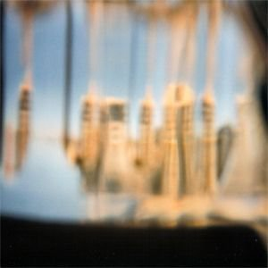

artist: **Peter Wright / The North Sea / Agitated Radio Pilot** release: _Split_ format: CD-R, MP3 year of release: 2005, 2007 label: [Deserted Village](http://www.desertedvillage.com/) duration: 63:05

detailed info: [discogs.com](http://www.discogs.com/Peter-Wright-North-Sea-Agitated-Radio-Pilot-Split/release/1290353)

This three way split is from the earlier days of the Irish **Deserted Village** label, but it is one the sold out releases that they have put up for free download on the web. Good thing, because this is an excellent album full of acoustic soundscapes and improvisations from each artist.

**Peter Wright** opens the album with three tracks of warm, bright drones. In the beginning of the slowly developing "Plume" we can still hear the individual twanging of strings, but they slowly submerge into waves of relaxing amber drones. Near the end of the track, a very subtle change in tone is introduced, which forms the bridge to second track, "Coruscation", which in its turn also fades seamlessly into "Heat Haze". Altogether, this may not be a groundbreaking set of tracks, but it surely gets the job done. This is acoustic-based shimmering ambient by the book, and guaranteed to make you drift away for twenty minutes.

Brad Rose's **The North Sea** is in an early stage here, compared to more recent releases. On this split, he focuses solely on improvisational piano tracks. Sometimes with, sometimes without effects, he manages to perpetuate the calm relaxing atmosphere of the split so far, while adding a touch of his own. Here and there these songs are sweet, but they can also be vague or estranging, or melancholic at times.

The best is saved for last though. Here we hear David Colohan as **Agitated Radio Pilot**, and in soundscape mode. Now, he did that occasionally on several releases, but rarely so fine as here, especially considering this is from 2005. "Broken Hill" introduces us immediately to this style, with layered accordion and organ drones. Subtle melodic progressions and live sounds are woven together to create a breathtaking melancholic soundscape. The short and beautiful "For Karen Ava" is based on a sad cello melody, later supported by organ drones and faint crackling, which serves, in a way, as lovely percussion. The split ends with "Umberumberka", which is again based on organ drones, embellished by more cello, but also by David's wordless vocals. These are three absolutely wonderful tracks, and only with the superb "The Barren Ground Assembly" was he able to equal this level, at least in term of ambient. Some of the best acoustic soundscapes I know of, and I hope **Agitated Radio Pilot** will continue to make them like this.

All in all, this is an excellent split, full of calm and emotional music. Try to find the original version second hand somewhere, or perhaps even better, [download this for free](http://www.last.fm/music/Various+Artists/Peter%2BWright%2B%252F%2BThe%2BNorth%2BSea%2B%252F%2BAgitated%2BRadio%2BPilot%2BSplit), but whatever you do, don't pass this one by if you like any of these projects, or great acoustic and/or ambient music in general.

Reviewed by **O.S.**

Tracklist:

**Peter Wright**: 1. Plume (9:58) 2. Coruscation (4:21) 3. Heat Haze (5:44)

**The North Sea**: 4. Embroidered Copper (4:08) 5. Batik (7:13) 6. Kaleidoscope Silk Print (3:02) 7. Ferns Pressed in Paper (7:29)

**Agitated Radio Pilot**: 8. Broken Hill (8:55) 9. For Karen Ava (3:49) 10. Umberumberka (8:26)
