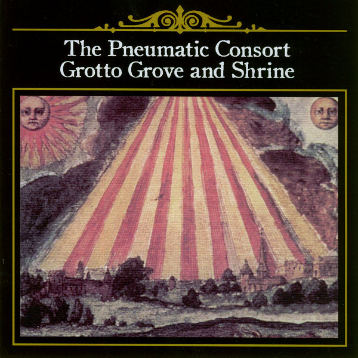

artist: **Aranis** release: _Aranis_ format: CD year of release: 2005, 2007 label: Self-released, [AntiClock](http://www.anticlock.net/) duration: 62:55

detailed info: [discogs.com](http://www.discogs.com/Aranis-Aranis/master/255855)

**Aranis** is a Flemish septet of classical musicians who have banded together to make innovative music on the borders of classical, folk, and (post-)rock. This self-titled debut was released in Flanders in 2005 - with support of the government no less - and has now been picked up by AntiClock records for an overseas/internation release. A good choice for this idiosyncratic label, for they've landed an original band that will have a broad appeal.

The compositions on this long album are predominantly instrumental, giving all the instruments ample opportunity to shine. We hear piano, flute, strings, and accordion, all played flawlessly and with feeling. Occasionally, we hear vocals in an imaginary language; on "Yosu" it is a female choir, which doesn't do much for me, but mostly because of the unoriginal melody in this track. "Zilezi", on the other hand, features male vocals, varying widely in intensity, like the track itself, which has very calm, brooding parts, but also wilder, heavier sections. The same can be said of the album in its entirity, actually. Some tracks are calm and subtle, whereas in others, the band really steps on the gas. In the latter category, "Vuur" is definitely my favourite. It alternates fast, rhythmic passages with ominous soft interludes to a great effect. A nice example of the dynamics that this band is capable of.

It's difficult to compare this music with any other styles, because of the unique sound. Elements from many diverse kinds of music are blended together so adeptly, that a comparison would be useless. On the downside, I find the final result a bit too clinical to really touch me to a deep level. All the same, these people have crafted an excellent and exciting album that should not be skipped by lovers of experimental music, contemporary classical, and crossover genres. Here's to an international release of the already finished second album!

Reviewed by **O.S.**

Tracklist:

1\. Indrigo (6:02) 2. Jona (4:16) 3. Vuur (6:52) 4. Yosu (5:28) 5. Oyma (6:07) 6. Zilezi (15:13) 7. Questosteron (4:29) 8. Pantra (5:36) 9. Labyrinth (4:03) 10. Wespengraf (4:49)
