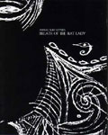

artist: **Astral Surf Gypsies** release: _Breath of the Rat Lady_ format: CD-R year of release: 2005 label: [Bunkier Productions](http://www.bunkierproductions.com/) duration: 48:14

detailed info: [discogs.com](http://www.discogs.com/Astral-Surf-Gypsies-Breath-Of-The-Rat-Lady/release/539303)

What to expect from a band called **Astral Surf Gypsies**, and an album called _Breath of the Rat Lady_? Well, I had no idea but it looked neat in it’s oversized packaging. There’s a really strange text written inside the package, about the Rat Lady and her children. There are also some strange looking paintings and symbols placed throughout it. I thought, if the music is half as weird, then it is really weird.

And the music then, ranging from strange folk music to some kind of half organic, half electric ambient, is not at all of low quality and it is full of nice ideas. But I can’t enjoy this the way I want to. I sat down and really listened to this album, two or three times. But I didn't understand what to look for, at times it sounded just like improvised nonsense. It is so psychedelic it becomes hard to listen to. The two men in the band have actually used many instruments to create their music, but after a while, all you can hear is swirling keyboards, guitars and voices. Then, in the middle of third listening, I turned on the computer, started surfing around, checking my mail and such everyday things. And **Astral Surf Gypsies** in the background sounded kind of pleasant. So I guess that's what it is for me, background music. I bet that if you can handle all the strange trips on this disc it’s a real high pointer.

I would like to namedrop some similar artists but I can’t think of anything like this. The nearest would be some psych folk from the 60’s but even there I can not find anything comparable. The bands MySpace site says that they are influenced by diverse shamanistic arts, Middle Eastern music, **Current 93**, **Sonic Youth**, **Simon Posford** and **Infected Mushroom** amongst others. Quite a spectrum, with other words. Some lyrics are adapted from the works of **Aleister Crowley**, just to bring even more strangeness in this absurd release.

If you are looking for something original and have a mind that can handle some of the most psychedelic tunes in 25 years, I think you should give **Astral Surf Gypsies** a chance. Or if you want something to play in the background...

Reviewed by **CME**

Tracklist:

1\. I Adore Thee In Song (4:15) 2. I Magi N'aton (6:19) 3. A Rifless Sea (7:36) 4. Ballad Of The Rat Thieves (10:06) 5. Taramis (I Am Star) (10:43) 6. The Veiless Mater (4:41) 7. Might Of Thy Breath (4:36)
