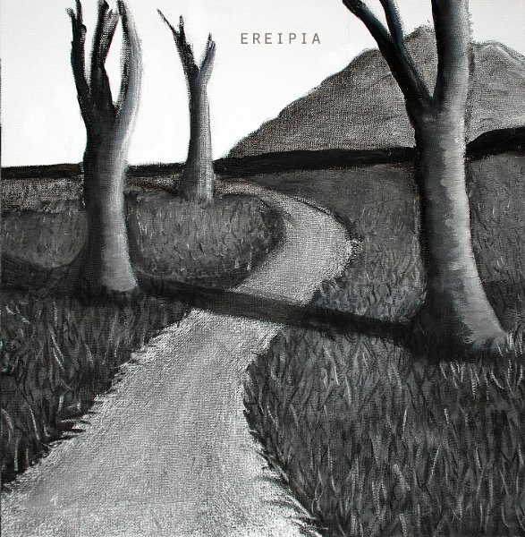

artist: **Ereipia** release: _Ereipia_ format: CD-R year of release: 2007 label: Self-released duration: 39:49

**Ereipia** is the neo-classical project of **Kostas Panagiotou** and **Andy Koski-Semmens** (both of doom metal band **Pantheist** and experimental band **Crippled Black Phoenix**). This self-titled demo CD-R is their first release, and intended to be released by a label in the future. However, no label has been found thus far, and that's surely a pity, because I think this is a very promising debut album that will hold appeal for a diverse audience.

The music is based on Kostas' compositions and Andy's classical voice, making this a project deserving of the label neo-classical. Influences from classical music, religious music, Mediterranean folk, minimal music, and many other styles are blended into a quite original new musical style. Listeners familiar with **Pantheist** will also recognise many of the compositional elements that went into their style of extreme metal.

The album opens with an instrumental intro, showing already many of the influences, and played on piano, keyboards, and cello. Though even more would be possible, the addition of genuine acoustic instruments is a welcome addition to this project, which does not suffer from the overly artificial sound that some neo-classical artists have. "Whirlpool" is a wonderful calm song that introduces us to Andy's voice, which is perhaps an acquired taste, but I feel it works better in this project than even in **Pantheist**. "Silent Acceptance" is another heavily piano-based track, a bit more uptempo than the previous one. Sutble touches of acoustic guitar add depth to the song, and in the end we are treated to a piece where Andy takes place behind the drum kit, another unexpected, but nice element of this album.

"This Side of the Looking Glass" is a cover of **Peter Hammill** (**Van Der Graaf Generator**). I'm very enthusiastic about this version, which captures the essence of the original in an excellent new way. Like all the tracks, it has some very melancholic lyrics, here expressed in a great song structure. Another highlight is the middle section, which will definitely appeal to fans of funeral doom metal and dark organ music. "Descent-Dance" is based on a melody all the way from **Pantheist**'s demo days in the beginning of the decade, and it turned into a nice complement to this album, with more excellent acoustic guitar and cello backing. "Letter to a Ghost" is the last proper track, and it perhaps the most narrative one, with Andy reading and singing aloud said letter. "Post Scriptum" picks up the final melody of the previous track, but turns it into a brief outro with drums and accordion.

Altogether, I am quite convinced by this demo, and I do hope some label will have the guts to pick these two men up and give this album a proper release. I really believe this will appeal to a broad range of listeners, whether they like neo-classical in general, funeral doom metal, or crossover classical genres. Though it is quite far away musically, I think a comparison with **Elend** would not be totally inappropriate, especially in terms of atmosphere. So, while there might be room for maturation in some aspects of the music, I think this demo is already on a higher level than many actual releases in the dark music scene.

Reviewed by **O.S.**

\[Note: currently also available through the band's own [Bandcamp](http://ereipia.bandcamp.com/album/ereipia)\]

Tracklist:

1\. Dream in C Minor (3:13) 2. Whirlpool (8:57) 3. Silent Acceptance (6:44) 4. This Side of the Looking Glass (6:27) 5. Descent-Dance (8:05) 6. Letter to a Ghost (4:32) 7. Post Scriptum (1:51)
