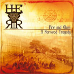

artist: **HERR** release: _Fire and Glass - A Norwood Tragedy_ format: CD year of release: 2007 label: [Cold Spring](http://www.coldspring.co.uk/) duration: 18:52

detailed info: [discogs.com](http://www.discogs.com/HERR-Fire-And-Glass-A-Norwood-Tragedy/release/1065175)

I hadn't heard **HERR** before, except for a gig which didn't impress me all that much. However, there's a first time for everything, and this new EP is actually quite nice. It is a concept album, about the rise and fall of Crystal Palace, the famous building in London. Troy Southgate wrote the narrative that accompanies this album, and it is read aloud by him over the course of these four tracks. It is a personal dedication to a symbol of beauty and culture, that was however cruelly destroyed as the result of two arsons.

Musically, this EP presents a smooth neo-classical soundtrack to Southgate's storytelling. A prominent role is laid out for piano and synths, and with excellent cello playing by Oskar van Dijk also featuring on three of the tracks. It all sounds quite stately and swirling, capturing the feeling that the building must have inspired, in a modern way. The melodies express the general mood of the tracks - wonder in the first, danger and loss in the second, etc. - in a subtle way, though also a bit too smoothly or easily. I would have liked to sense a bit more fireworks in the presentation and sound of the songs, where that would have matched the narrative content. As it is now, I often sense a bit of an emotional distance between the two, and I would have preferred a more intense link. This, then, is the main weak point of the EP: perhaps it could have achieved more emotional power.

Nevertheless, this is a very pleasant EP to listen to, and I find it an honourable tribute to Crystal Palace, now in ruins. I think fans of the band should not be disappointed by this release, and I also recommend it to people generally interested in neo-classical music.

Reviewed by **O.S.**

**Tracklist:**

1\. Sparks of the Imaginative Mind (4:31) 2. Drowning in Showers of Melting Glass (5:49) 3. Memoirs of Light (3:08) 4. Embers (5:24)
