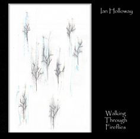

artist: **Ian Holloway** release: _Walking Through Fireflies_ format: CD-R year of release: 2007 label: [Quiet World](http://www.quietworld.co.uk/) duration: 42:43

Normally, **Ian Holloway** records under the name of **Psychic Space Invasion**, but for this release, actually the first official Quiet World release, he uses his own name. This is, in a way, appropriate, for _Walking Through Fireflies_ is quite different from the **PSI** releases so far; both more dark and more personal, I feel. It is dedicated to Vic Golightly, a deceased friend, and a lot of feeling went into this tribute.

All the same, this Welsh artist stays within his genre: dark drones and ambiences. And as always, he knows what he's doing. The tracks on this album are quite minimalistic, making use of sparse settings of synth waves, slow melodies, occasional samples, and the like. It's a slowly drifting series of bleak sounds, suitable for dark and rainy days like the ones we're having now right here.

The major parts of the album crawls along in this fashion, and though it's atmospheric, I don't find it as exciting as some of Ian's other works. This changes in the last two tracks though, which are more than excellent. "Tower of Winds" is one of the darkest ambient tracks I've heard in a while, with a solid, low droning base, and layered effects providing the melody. It's hard to describe, but this is one hell of a track: scary, oppressive, heavy. Equally impressive is "Sunnyshine", a deceiving name if there ever was one. No happy-happy-joy-joy here, but just one gloomy mass of melancholic synth waves.

So, while the first part of the album is OK, but not incredible, the last two tracks surely make up for that. As a whole, this album is a bleak exercise in ambient electronics, and it shows some of the more darker sides of the expression of mourning - a fitting tribute for a lost friend, in any case. This is a recommended album for drone and dark ambient enthusiasts, and another well done release by Holloway. A good start for Quiet World.

Reviewed by **O.S.**

Tracklist:

1\. New Seasons (5:50) 2. Trimmed (4:26) 3. The Fall of the Year (4:01) 4. A Lighter Being (4:23) 5. The Birds Banquet (9:36) 6. Tower of Winds (7:12) 7. Sunnyshine (7:15)
