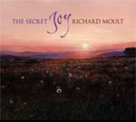

artist: **Richard Moult** release: _The Secret Joy_ format: CD year of release: 2005 label: [Cynfeirdd](http://www.cynfeirdd.com/) duration: 32:34

detailed info: [discogs.com](http://www.discogs.com/Richard-Moult-The-Secret-Joy/release/1432802).

**Richard Moult** is an English composer and painter, who, besides many solo works, has worked with **Current 93** and is currently a part of **Far Black Furlong**. But this album, released by Cynfeirdd, focuses on his own compositions of neo-romantic classical songs. It ultimately originates in Richard's setting to music of poems by **Mary Webb**, a English writer from the early 20th century. The compositions are generally from before 2005, when this album was released, and a number of these poems feature in other releases by Moult (_Presences_ and _There Are Four Sides to the Night_). _The Secret Joy_ was recorded live in the church of St. Mary Magdalene in Bleddfa, Wales. Piano was performed by **Nicholas Chalmers** and the vocals are by **Kathy Taylor-Jones** (mezzo-soprano) and **Kate Hopkins** (soprano). 

So, as I said, the album consists of settings of poems, most of them by **Mary Webb**, except for "Wolfram's Dirge" (**Thomas Lovell Beddoes**) and "Now Are the Hills Born New in Sparkling Light" (**Ivor Gurney**). As they are pieces for vocals and piano, I am quickly reminded of **Franz Schubert**'s works like _Die Schöne Müllerin_ and _Die Winterreise_. Not just because of the instruments used, but also because of the music in general. I think it's safe to say that Moult is heavily inspired by romantic composers like **Schubert**, while not becoming a copycat of that earlier style. I didn't write neo-romantic for nothing above, and I think it's plain that there are also a lot of modern influences audible in the compositions. For me, that balance between old new sounds very pleasant, as does the music in general, by the way. Moult creates moving melodies with sweeping dynamics, in both the vocal and the piano department.

The pieces are, on average, rather short, like the poems - often giving brief impressions of nature and romantic spirituality. I guess you have to be a true romantic to be able to appreciate many of these poems; they describe the wonder and sublime feelings of the poet when confronted with the smaller beauties of nature. Most of the time, I can relate very much with what's going on, though to be honest, I am not particularly fond of classical voices, and for me they create a distance from the subject matter, rather than an involvement. For me, natural subjects call for a more natural approach to singing, if there is such a thing. At times, thus, I think the vocals are distracting from the inherent feelings of the poems and music. Nevertheless, there are many places in which this album works extremely well, such as the opening track and "Like a Poppy on a Tower". The three final tracks are each excellent as well. "Wolfram's Dirge" is a slightly darker, louder piece, and it reminds me of **Schubert**'s _Die Winterreise_ most of all. "Now Are the Hills Born New in Sparkling Light" is the track where I feel the music, words and vocals work together best - a marvellous piece. "The Sedge-Warbler", finally has a quite wonderful piano melody.

While this classical approach to romanticism is not necessarily my favourite one, I respect and understand what **Richard Moult** tried to achieve here, and I think he has succeeded admirably. By the way, the album cover and little booklet of this digipak all hint at the marvellous paintings by Richard - I would have liked to see more. So, if you're a romantic soul, you should give this album (and his other compositions) a try, especially if you enjoy the classical inspirations of this album.

Reviewed by **O.S.**

Tracklist:

1\. Presences (4:20) 2. A Hawthorn Berry (2:45) 3. Dawn (1:39) 4. A Summer Day (1:44) 5. A Night Sky (3:23) 6. Like a Poppy on a Tower (1:09) 7. The Shell (2:12) 8. The Snowdrop (2:26) 

_The Secret Joy:_ 9. I Roseberries (0:56) 10. II A Rainy Day (1:04) 11. III Be Still You Little Leaves (1:44) 12. IV The Secret Joy (1:39)

13\. Wolfram's Dirge (2:51) 14. Now Are the Hills Born New in Sparkling Light (2:35) 15. The Sedge-Warbler (2:07)
