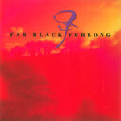
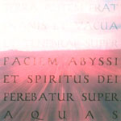

Far Black Furlong

artist: **Far Black Furlong**  
release: _Far Black Furlong_ / _Haidd 2_  
format: 2xCD  
year of release: 2007  
label: [ICR](http://www.icrdistribution.com/)  
duration: 1:34:05

detailed info: [discogs.com](http://www.discogs.com/Far-Black-Furlong-Far-Black-Furlong-Haidd-2/release/1113414)

After being thoroughly impressed by the previous EP [_The East Room_](http://www.eveningoflight.nl/2007/10/01/review-far-black-furlong-the-east-room-2006/), I kept a close eye on **Far Black Furlong**, one of the most promising experimental folk and ambient projects to come out of the UK in recent times. I was, of course, very excited about this new release, and a double one, no less. The self-titled album is actually the first full length release by the band, and for good measure, the first edition of it comes with a bonus disc, containing a reworked version of the _Haidd_ EP, which was released on Barl Fire records in 2006.

The music on _Far Black Furlong_ keeps the middle ground between the electro-acoustic ambient of _Haidd_ and the improvised folk sounds of _The East Room_. In addition, elements both old and new are added to the mix. Poet **Bryony Lees**, who appeared on the _Full Gathering Moon_ EP, starts off the album with a reading another of her poems. Now, poetry recitals are always a bit hit-and-miss for me, and I'm afraid I find the reading a bit lacklustre; it distracts from the poem itself, which is actually very good, not to mention mysterious and fitting to the music. During the recital, some new instruments are introduced into the mix as well: flute by **Amanda Votta** (**The Floating World**) and hammered dulcimer by **John Letcher**. Both guest artists add great depth to the soundscapes on this album, and especially the dulcimer has a very prominent role on the album.

The album is constructed as a whole, but it is divided into six seamless movements, each with its own mood. The first one, as said, features the poem, and introduces the mysterious soundscapes the make up the rest of the album. Over the course of it, we're treated to that typical mixture of ambient soundscapes, but with solo roles for many of the instruments. The second track focuses mostly on the dulcimer, while the third has a prominent role for flute and field recordings. It gradually fades into the epic fourth movement, where dulcimer and electric guitar enter into an exciting duet. The fifth, then, features a piece of the wonderful oboe work of **Mark Baigent** which shone on _The East Room_. Accompanying it, more of **Ian Tengwall**'s guitar playing, and let's not forget **Richard Moult** on piano! But, underneath, the current is picking up, hinting at **Andy Cotterill**'s dark ambient waves that dominate the final movement.

I find all of this incredibly rewarding. The musical depth and detail is magnificent, and rewards close listening, yet it is also strong enough to impress on a superficial going-over. Abstract though most of the music may be, there are strong thematic suggestions: the turning of the seasons and nature's cycles, inner and outer landscapes... exactly what I love to hear in music of this kind.

Haidd 2

Then, a few words about the bonus disc. The original _Haidd_ was the band's most abstract piece thus far, and in that sense, _Haidd 2_ is a natural follow-up. In actual fact, it takes the 'ambientness' a step further. The original featured sections of oboe and other instruments, and parts of it were constructed in a way similar to the self-titled album reviewed here. But _Haidd 2_ is really stripped down, compared to that. **Andy Cotterill** really took the track apart and moulded it into a massive, but subtle ambient track. Both versions share the forlorn, drifting atmosphere, but the new version intensifies it through a minimalism of sound. The result is quite simply an excellent, detailed half hour drone trip - well worth the extra money for the special edition, in any case!

In short, **Far Black Furlong** haven't ceased to amaze me so far. If you're looking for thoroughly original music that seamlessly blends acoustics and electronics, folk, ambient, classical, improv, etc., etc. - this is it... Highly recommended, and one of the best albums of the year.

Reviewed by **O.S.**

Tracklist:

_Far Black Furlong:_  
1\. One (3:01)  
2\. Two (7:49)  
3\. Three (4:53)  
4\. Four (11:31)  
5\. Five (12:56)  
6\. Six (19:48)

_Haidd 2:_  
1\. Haidd 2 (34:07)
