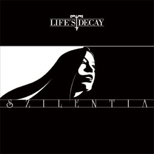

artist: **Life's Decay** release: _Szilentia_ format: CD year of release: 2007 label: [Abstraktsens Produktions](http://www.abstraktsens.com/) duration: 50:27

detailed info: [discogs.com](http://www.discogs.com/Lifes-Decay-Szilentia/release/1073531)

_Szilentia_ is already the fourth full-length album by **Life's Decay** from France, and as expected, they continue on in their original style, somewhere between neo-classical, martial, and industrial music. And, once again, we are treated to classy artwork and layout by Lyktwasst..

The album starts off with great force, and one of the best tracks: "Retroscape". Ominous sounds of a ticking clock are coupled with devastating snare rhythms and a minimal melody. Based on this track, I expected a somewhat heavier approach to the music than before. However, this is only true of some of the tracks. I'm afraid some of the calmer tracks don't work as well as on _Lysselia_. Alea's soft voice sometimes edges a bit close to the overly sweet, which doesn't fit the music. I prefer it when she sings in a more threatening manner, as in some of the occasional shouts, whispers, or just 'darker' vocals. On the whole, there is a pleasant amount of dynamics in the album, and the contrast between heavier and softer parts is very well done. Nevertheless, it is mainly the heavier and rhythmic parts of the album that are really interesting, and where the strength of the project lies at the moment. Especially a track like "Sziktalia" is very convincing, with a strong mix of crushing percussion and sampled violin.

It seems to me that this album is better than its predecessor in some respects, but also worse. The percussion and rhythm section is better than ever, and often catchy and powerful. The sound of the instruments is also very pleasant. However, for some reason I found _Lysselia_ a bit more atmospheric, and I preferred the vocals on that album. All in all, it's still a very nice album though, and certainly worth checking out if you like the project or crossovers of martial and industrial music.

Reviewed by **O.S.**

Tracklist:

1\. Retroscape (3:33) 2. Inksterna (4:45) 3. Calm (5:34) 4. Stukarcht (3:04) 5. Sziktalia (3:07) 6. Diluvia (5:32) 7. Katalena (3:58) 8. Descence (3:56) 9. Claressa (3:40) 10. Lawsia (2:25) 11. Ambvience (6:38) 12. Lektvr (4:15)
