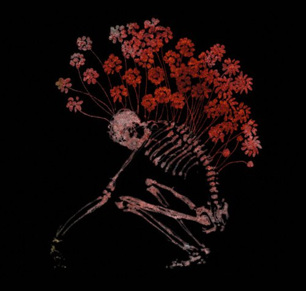

artist: **Sand Snowman** release: _Flicker Fading Spark_ format: MP3 year of release: 2007 label: [Woven Wheat Whispers](http://www.wovenwheatwhispers.co.uk/Folk_community/pc/home.asp?idaffiliate=13) duration: 12:03

detailed info: [discogs.com](http://www.discogs.com/Sand-Snowman-Flicker-Fading-Spark/release/1608320)

Some of our readers might remember I wasn't thoroughly impressed with **Sand Snowman**'s first album, [_Moth Dream_](http://www.eveningoflight.nl/2006/10/01/review-sand-snowman-moth-dream-2006/ "Review: Sand Snowman – Moth Dream (2006)"). Well, since then, a new album has appeared (_I'm Not Here_), which I haven't heard yet. This EP is the follow up of that album, and the third release on **Woven Wheat Whispers**, and I must say, I find some great improvement here.

**Sand Snowman** has managed to hold on to the typical mix of folk and proggy acoustics, but this time around, it works seamlessly. Since the last album, Sand has called in the aid of female singers Nix and Moonswift, the last of which appears on the opening track of this EP. So, what do we hear? Expert acoustic guitar fingerpicking, subtle bass and percussion, some electric guitar and FX, and finally Moonswift's soft, dreamy vocals. Many of the elements are the same as on the first album, but somehow it all just works better, and sounds more original.

"Magpie Eye" is all instrumental, and starts off quite fast with another great guitar melody. Later in the track, it slows down a bit, blanketed in reverb-drenched piano and other string instruments. The final, short track is also instrumental, but it features wordless vocals by Moonswift again. A very relaxed track, which somehow stresses that quaint old school prog feeling again.

All in all, a fine EP, and a nice teaser for the new album, _The Twilight Game_, which was also recently released on WWW. Probably it's due to some common influence, but this also reminds me of **Opeth**'s acoustic works. So, if you like that as well, and/or just psychy and proggy folk, check this one out.

Reviewed by **O.S.**

Tracklist:

1\. The Last Candle (5:41) 2. Magpie Eye (3:54) 3. Fading Spark (2:28)
