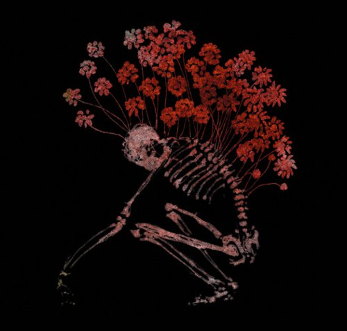

artist: **Tenhi** release: _Folk Aesthetic 1996-2006_ format: 3xCD year of release: 2007 label: [Prophecy](http://www.prophecy.cd/) duration: 3:00:39

detailed info: [discogs.com](http://www.discogs.com/Tenhi-Folk-Aesthetic-1996-2006/release/1042968)

This 3-CD collection celebrates the 10 year anniversary of **Tenhi** in 2006. Over the years, these Finns have released four full-length albums and two EPs, containing what I consider to be some of the finest folk-influenced acoustic music of today. The _Folk Aesthetic_ set is an overview of some of the more difficult to find material by the band, including the demo, EPs, and loads of unreleased tracks and alternative versions. At the same time, it functions as showcase of the diversity of the band, and the progression they've made over the years. It's all packaged in a gorgeous digipak - as we've come to expect - along with a very extensive booklet, which shows some of the latest visual artworks by the band. Indeed, you can't detach one form of art from the other when it comes to **Tenhi**.

I'll begin with an overview of what the three CDs contain. The first one has all the official releases by the band. In the first place, this is the quite rare _Kertomuksia_ demo from 1997. It contains early versions of two tracks which later ended up on albums, as well as a unique one, "Havuisissa Saleissa". This second track shows some of the faint heavy metal influences in the early stages of the band, with an aggressive sound in the drumming and vocals, which definitely fits the song, however. "Tenhi" is also an interesting version of later track on _Väre_, featuring field recordings and effects, which suits this calm instrumental very well. The _Hallavedet_ MCD is another one from the early days, which doesn't quite reach up to the level of the 1999 debut album _Kauan_ yet. _Airut:ciwi_ is an entirely different case though. This EP from 2001 is quite excellent, especially the wonderful "Kielo" which, in this version, is one of my favourite tracks by the band overall. Only the inclusion of this EP should already be reason enough for **Tenhi** enthusiasts to buy this collection.

But, there's more, of course! The second CD contains a mishmash of alternative versions and new tracks. The first song, "Kausienranta", is one of those new ones, and it representative of the elaborate style of the band right now. It was originally recorded for _Maaäet_, but now sees light here, with an accompanying music video, which is more than worth checking out. Most of the other tracks on this CD are alternative or demo version of album tracks, which show a different side of these existing songs. Most of them are really interesting, like "Suortuva" with drums and "Tuulenkato" with added guitar. Some other tracks are new: "Linnuit" is a calm guitar-based song, also written recently, which shows a very nice new side of the band. "Sydänvalkea" was released on the web several years ago, but remained a fan-only obscurity. It's nice to see it back here, as it's a fine piece of typically **Tenhi** 'guitar and vocals'. A final mention goes to the final track, "Niin Auer Hilja Vie", a brilliant guitar instrumental, and another one of my favourite tracks.

The last CD is a 'new' album put together from reworked demos and unreleased tracks. It contains a nice mix of new and old material, mostly quite impressionistic in style, and not as elaborately written as the later album material. On the whole, I think this results in a slightly lesser quality level than on those latest albums, but there is still a lot of good material in here. "Sarahdus" is a good example, a very simple but moody piano track, which was also released online a couple of years ago, only to disappear shortly after. "Tuuli Varista" combines excellent guitar work with brilliant a capella singing in the middle part of the track, showing another new side of the band. This middle part is quite ambient like, the vocals fading into dark effects. Near the end, the guitar melody returns. And I just have to mention the final track of this collection, "Neidiie". It was recorded for the _Airut:aamujen_ sessions, but got left out. I'm not sure why, but I'm glad it returns here. An absolutely brilliant piano ballad with a deep, hopeful melody.

I feel one shouldn't approach this collection as a whole; it might be a bit too incoherent to be able to service as a 'big album'. However, it is incredibly satisfying to pick out a song here and there on this album and listen to it intensively. This way, you'll discover the variety and quality that lies in the music these men have made over the past decade. Read along with the lyrics, take a good look at the excellent drawings and paintings - I hope you'll be convinced as I am that **Tenhi** is one of the finest folk-aesthetical projects around today.

Reviewed by **O.S.**

Tracklist:

**I:** _Kertomuksia demo 1997:_ 1. Näkin Laulu (6:52) 2. Havuisissa Saleissa (9:18) 3. Tenhi (6:52)

_Hallavedet mcd 1998:_ 4. Hallavedet (7:38) 5. Hiljaiseksi Lampi Jää (8:12)

_Airut:ciwi mcd 2001:_ 6. Tuulennostatus (1:50) 7. Kielo (10:42) 8. Ciwenkierto (6:26)

**II:** _Alternatives and Unreleased:_ 1. Kausienranta (6:00) 2. Suortuva (7:31) 3. Etäisyyksien Taa (5:34) 4. Linnuit (4:00) 5. Tuulenkato (5:04) 6. Sydänvalkea (4:26) 7. Kuoppa (4:21) 8. Korvenraivaajat (5:29) 9. Kielo (12:28) 10. Niin Auer Hiljaa Vie (7:36)

**III:** _Kaski 1996-2006:_ 1. Häie (4:14) 2. Luo Varjo (11:07) 3. Koiranlainen Peura (6:45) 4. Suruiksi Soi (8:54) 5. Sarahdus (6:36) 6. Tuuli Varista (7:42) 7. Laule (1:24) 8. Vasen (9:38) 9. Neidiie (4:00)
