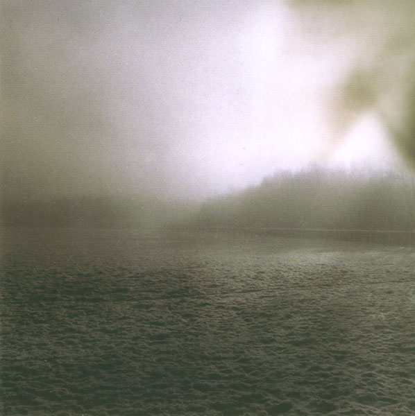

artist: **Agitated Radio Pilot** release: _World Winding Down_ format: 2xCD year of release: 2007 label: [DeadSlackString](http://www.desertedvillage.com/) duration: 1:36:27

detailed info: [discogs.com](http://www.discogs.com/Agitated-Radio-Pilot-World-Winding-Down/release/1432028)

Released in late 2007, _World Winding Down_ is **Agitated Radio Pilot**'s first album on (non-recordable) CD, and a double one at that! It also might turn out to be **David Colohan**'s masterpiece, because I would surely be intimidated if the project ever manages to create something even better. Little known though it is, I believe music like this is so much better than most of what gets released nowadays in related areas like folk and singer/songwriter. On this album, **Agitated Radio Pilot** takes elements from those genres and really pushes them beyond into brilliant new territories.

In a way, _World Winding Down_ is a logical follow-up to 2006's _Your Turn To Go it Alone_; the main emphasis is again on melancholic songs based on guitar and vocals. However, the role of instrumentals has become bigger, making this album the, for me, perfect synthesis of great songs and beautiful acoustic soundscapes and interludes. An impressive host of guest artists provides instrumental and vocal support to all of this; it would be a bit much to list all them - they fill up an entire page on the booklet - but some of the more important are **Richard Moult** (**Far Black Furlong**) on piano, **Maja Elliott** on keyboards and vocals, and **Alison O'Donnell** (**Mellow Candle**) on vocals. Another important element are the many field recordings (mainly by **Gavin Prior** and **Anders Gjerde**) and bird songs that are subtly woven into both the songs and the instrumentals.

Now, for a brief impression of the structure of the album. Not only is this a double album, there is also a very strong symmetry between _Numinous Blues_ and _Luminous Blues_. Both have twelve tracks, to start with, and are about 45 to 50 minutes long. But the nature of the corresponding tracks on each half is also quite similar. The first track on both sides is an instrumental intro. The one half has a warm droning soundscape, while the other has beautiful short piano composition by **Richard Moult** with guest vocals by **Larissa Pychlau** (**Cele**) and added effects. The second and third tracks are all excellent examples of Colohan's typical type of songwriting. Especially "All That Fall" and "Around Closing Time" display his undeniable talent for both song and lyric writing. The fourth tracks take this even further though; "Caroline Sings" and "Take Heed of Your Hurt" are both stunningly beautiful songs, each with backing vocals by O'Donnell and keyboards by Elliott. Tracks five are both interludes, and the sixes and sevens contain (what else) central tracks. The title track and "Another Day" (a **Roy Harper** cover) are both great, but the sevens must be some of my absolute favourites. On this pair, **Richard Moult** and **David Colohan** form the perfect duo, bringing two extraordinarily beautiful piano songs. I hope to hear these two together more often in the future! The symmetry is a bit less from this point on, but mention goes anyway to "Earthfasts", another one of my favourite tracks. It's the longest one, and a great exercise in freefolk experimentation. It starts off with some great bluesy guitar and strings work by **Richard Skelton**, and then moves into great modern folk piece, where most of the female guest vocalists join in as a choir, also featuring **Sharron Kraus** this time. The two by two times final tracks are again similar. The elevens are final pieces of regular song, while the two closing tracks take a laid-back ambient approach, ending both sides of the album on a moody, melancholic note.

Though the album is not without a few flaws (mostly to do with performance of some of the guest vocalists and some of the noisy guitar solos), if there's any album that has enough merit to cover up tiny blemishes ten times over, it's this one. The way already excellent songs are combined with the musical detail and depth of sound that we hear on all of these songs here is the mark of a true classic. In this way, _World Winding Down_ transcends genre limitations and unites the best elements from different areas of music. Of course it still is, mainly, a 'folk' album, but you'll soon discover that is also much more. Just as the basic melodies of the folk song become something more through the combination with soundscapes and experimentation, so do the lyrics, and a song which in other contexts would be 'just' about love and loss, becomes even more profound.

If it's not clear by now that I'm enthusiastic about this album, you haven't been reading very well. This is easily my favourite album of 2007, and one of those rare albums that makes me doubt whether I should break my rule of not giving higher grades than 9 when an album is just released. Enough talk - go out and give this one a listen, and spread the word. If Colohan doesn't get any recognition for this, the world is a poor place...

Reviewed by **O.S.**

Tracklist:

**I. Numinous Blues:** 1. A Darkness Made of Beating Wings (4:16) 2. All That Fall (3:39) 3. Everybody Lives (Just This Once) (3:24) 4. Caroline Sings (5:33) 5. For Medb (2:32) 6. World Winding Down (5:43) 7. The Gathering Dark (2:28) 8. You Were Always in My Arms Forever (6:57) 9. The Life You'll Leave Behind (4:05) 10. Mt Argus to Mt Jerome (1:57) 11. People Start Over (3:05) 12. Leave the City on Foot (7:01)

**II. Luminous Blues:** 1. On Cape Clear (2:07) 2. Around Closing Time (4:00) 3. An Ear to the River (4:14) 4. Take Heed of Your Hurt (3:06) 5. The Lamplit Wood (1:55) 6. Another Day (4:24) 7. Along the Trails of Midnight Deer (2:40) 8. Botanic Avenue (4:04) 9. The Awakening Clay (2:47) 10. Earthfasts (10:31) 11. Shorelines Clad in Snow (3:57) 12. Everything Ends (2:02)
