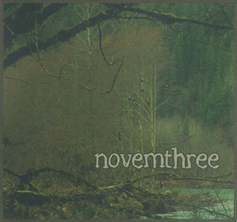
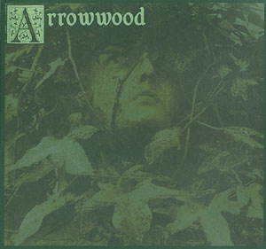

artist: Arrowwood / novemthree release: Split format: 2x 3" CD-R year of release: 2007 label: [Little Somebody](http://www.myspace.com/littlesomebody) duration: 38:23

detailed info: [discogs.com](http://www.discogs.com/Arrowwood-Novemthree-Untitled/release/1222846)

The latest on Little Somebody Records is a cute little double 3" split between **Arrowwood** (Chelsea Robb) and **novemthree** (Pythagumus Marshall). Like I've come to expect, the housing is excellent: the discs are in a pretty handmade gatefold, lined with fabric on the inside. The music is also quite OK, because we get some fine dark foresty folk tunes from both artists.

**Arrowwood** plays a kind of neofolk, based on dark melancholic guitar and banjo melodies, combined with touches such as bells, glockenspiel, and flute. Chelsea's voice is remarkable: a sort of girlish fairy voice, which contrasts quite strongly with the sometimes dark and horrid lyrics. On her side of the split, we get a solid collection of short songs, which may not be the most original or varied, but definitely atmospheric.

**Novemthree**'s music, as some readers of our mag may know, is relatively similar, except of course for Pythagumus' voice, and a greater emphasis on percussion. This side of the split features again a nice selection of tracks. "Scythe to the Grass" is a reworked version of the track that appeared on the downloadable part of the _John Barleycorn Reborn_ compilation. "Stones of Blood", like the others, is a new track, featuring hummed vocals and skin drum (bongo-like) percussion. In general, I think these tracks are on the level of those on _of my mother's weary wandering_, although I miss an actual _song_ with sung lyrics. The closing track, "Vespers", makes up for that, however; it's a brilliant melancholic instrumental with excellent piano work by guest artist **Kelly Wise**.

In short, this is another nice release from this label, with atmospheric nature-inspired folk tunes, and a great layout. If you liked what came before on the label, this won't disappoint you, but even if you're not familiar with the label yet, you might want to check this out if you are into dark and foresty folk atmospheres.

Reviewed by **O.S.**

Tracklist:

**Arrowwood:** 1. Hawthorne Wheel (1:07) 2. Funeral Lullaby (2:10) 3. Bells in an Old Forest (2:04) 4. With My Heart in My Head Like One Eye (3:30) 5. Rising Hill (2:09) 6. Hockwold (2:01) 7. Winged Sirens (0:57) 8. Mountain Water Reprise (3:00)

**novemthree**: 9. Scythe to the Grass (reworked) (3:07) 10. Stones of Blood (2:33) 11. Beneath the Hemlock, Within the Grove (3:49) 12. Winding Away Through the Thicket (2:16) 13. To Breathe in the Trees (5:50) 14. Vespers (3:50)
