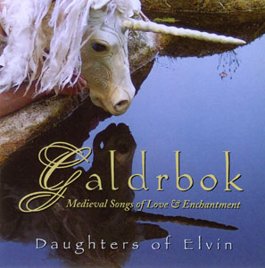

artist: Daughters of Elvin release: Galdrbok format: CD year of release: 2008 label: [Self-released](http://www.myspace.com/daughtersofelvin) duration: 67:02

**Daughters of Elvin** is a British mediaeval music and performance ensemble, and _Galdrbok_ is their second studio album. Members on this album are **Katy Marchant** (recorders, pipes, etc.), **Stephen Tyler** (hurdy gurdy, harp, percussion), **Dhevdhas Nair** (hammered dulcimer, percussion, etc.), **Mike Edwards** (bass viol), and **Jennie Cassidy** and **Sophia Brumfitt** on vocals. Selected for this release were songs and dances from around the Mediterranean (France, Italy, Spain), mostly from the 13th and 14th century, with love and enchantment as a theme.

The album starts off very well with "Ondas do Mar de Vigo", which has a stunningly beautiful vocal melody. Combined with the excellent arrangements for support instruments (harp and hammered dulcimer), this track shows that we're dealing with a highly skilled ensemble that can be considered among the best in Europe. And frankly, the rest of the album doesn't disappoint either. There is an alternation between songs and dances, where especially the first are excellent in my opinion. "A Chantar M'er..." is another fine example; like many other tracks on the album a beautiful sad love song from days gone by. Other favourites from the first section of the album are "Abundance de Felonie" (great combination of vocals, viol, and dulcimer), and "Mandad 'ei Comigo" (dance with percussion, hurdy gurdy, vocals). **Daughters of Elvin**'s version of "Tristan's Lament" is also very interesting: the brooding mix of deep drums and flute is a pleasant change from other versions of the - definitely beautiful - tune I've heard. However, I didn't care too much for the version of "La Rotta" that follows. This one's always a funky dance, but I find it a bit sterile here. The first half of the track certainly didn't need this one stuck on for extra dynamics, as there's already plenty of that in the album as a whole. The last two tracks are excellent though: "Horamay che Fora Son" is a stately song with some beautiful recorder and viol work. "Galdrbok" \[Old Norse for 'Book of Spellsongs'\], finally, is the ensemble's only own composition, written by Marchant and Tyler on their honeymoon. It's a nice catchy dance with a big role for percussion, pipes and hurdy gurdy.

Before I heard this album, I always thought **Daughters of Elvin** were mainly about performance, but it so happens that they've been able to make an excellent studio album as well. I'd love to see them in live action some day, and I imagine it will be quite different from this, but if you don't get the chance to witness the theatrical side of the ensemble, complete with gorgeous masks and costumes, _Galdrbok_ is a good comforter. Recommended to all mediaeval music lovers.

Reviewed by **O.S.**

Tracklist:

1\. Ondas do Mar de Vigo (6:38) 2. Domna, pos Vos ay Chauside (3:09) 3. A Chantar M'er de So Qu'ieu Non Volria (4:59) 4. Abundance de Felonie (7:22) 5. Su la Rivera (4:27) 6. Voulez Vous que Je Vous Chant (5:27) 7. Mandad 'ei Comigo (3:20) 8. Ognor Mi Trovo (3:19) 9. De la Grand Joie d'Amors (7:26) 10. Lamento di Tristano / La Rotta (8:27) 11. Horamay che Fora Son (6:35) 12. Galdrbok (5:53)
