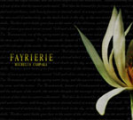

artist: Fayrierie release: Michelia Campka format: CD year of release: 2007 label: [Caustic Records](http://www.causticrecords.com/) duration: 44:55

detailed info: [discogs.com](http://www.discogs.com/Fayrierie-Michelia-Campaka/release/1163241)

Spain’s dark folk scene hasn't really exploded yet. I can think of very few bands, and even fewer proper releases. But here is one for you and it’s quite nice, really! The music on **Fayrierie**’s debut falls into the same category of folk music as **Dwelling** with a hint of **Empyrium**. Melodic, romantic, tranquil, melancholic... The songs are centred on the almost ever-present acoustic guitars. There is a minor use of electronics, mostly in the background. The parts and tracks where the synthesizers are prominent are the least interesting ones so I guess my favourite instrument of all times has saved another album.

For this album, **Fayrierie** has looked deep into the pagan traditions of the world, collecting both fairytales and mythological stories to use as lyrical and musical influences. The inside of the digipack does not include the lyrics, but there are explanations to the songs, which are really nice to read while listening. They boost the mood nicely.

From the people I have played the album for, I have heard some complaints about Norax’s voice. Things like "he sings too strong for this kind of soft music", "in the deeper parts, his voice seems to get stuck in the throat" and "he should be singing heavy metal ballads". I have also stumbled across some reviews, which are pointing out the same issues. Sure, it took me a while to get used to the vocals but now I can’t imagine this album with a different singer. Norax is doing a great job behind the microphone and should be as proud as he sounds. Musically there isn't much to complain about. Falke, who performs the tunes, sounds like a confident musician.

What I like most about this album is its variation. The songs usually start in one way and end in a completely different one. There is no space for boredom here at all, the sound is ever-changing. The ten tracks could easily be divided into 25 shorter ones. This, though, makes it hard to point out my favourite tracks. I'd rather point out favourite parts. The chorus in "A Night of Tears over the Snow" is the first highlight. Also, the instrumental part short after the chorus is sung for the first time is stunning. The first, instrumental minutes of "Enbarr" really capture me, and so does the spoken-word part of "Nature and the Poet". The female vocals in "Orphaned Forest Lullaby" are really good and the following (and closing track) is superb in every way. On the other side, "Crepuscle" is a kind of boring one, where the rule about guitars / electronics I stated in the beginning of the review is valid. Some things are not bad, but pretty pale in comparison to the highlights. I like the addition of violin but it’s often misplaced throughout the record. Some parts are just screaming for some strings but it’s strictly limited to parts where it often does not fit at all. But all in all, I have no problems with enjoying _Michelia Campka_ and its comfortable melancholy.

Reviewed by **CME**

Tracklist:

1\. To Fayrierie (3:12) 2. Water Of Moon (5:23) 3. A Night Of Tears Over The Snow (5:00) 4. Crepuscle (3:51) 5. ...Of Magic Dances And Fairies' Rings (4:58) 6. Enbarr (3:02) 7. Aranmanoth (5:49) 8. Nature And The Poet (3:41) 9. Orphaned Forest Lullaby (6:09) 10. Romeca-Calelha (3:50)
